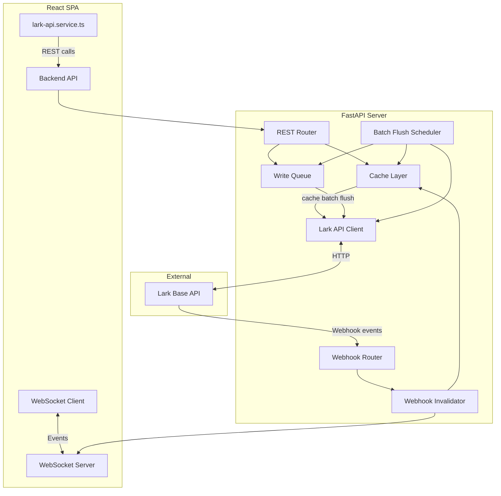
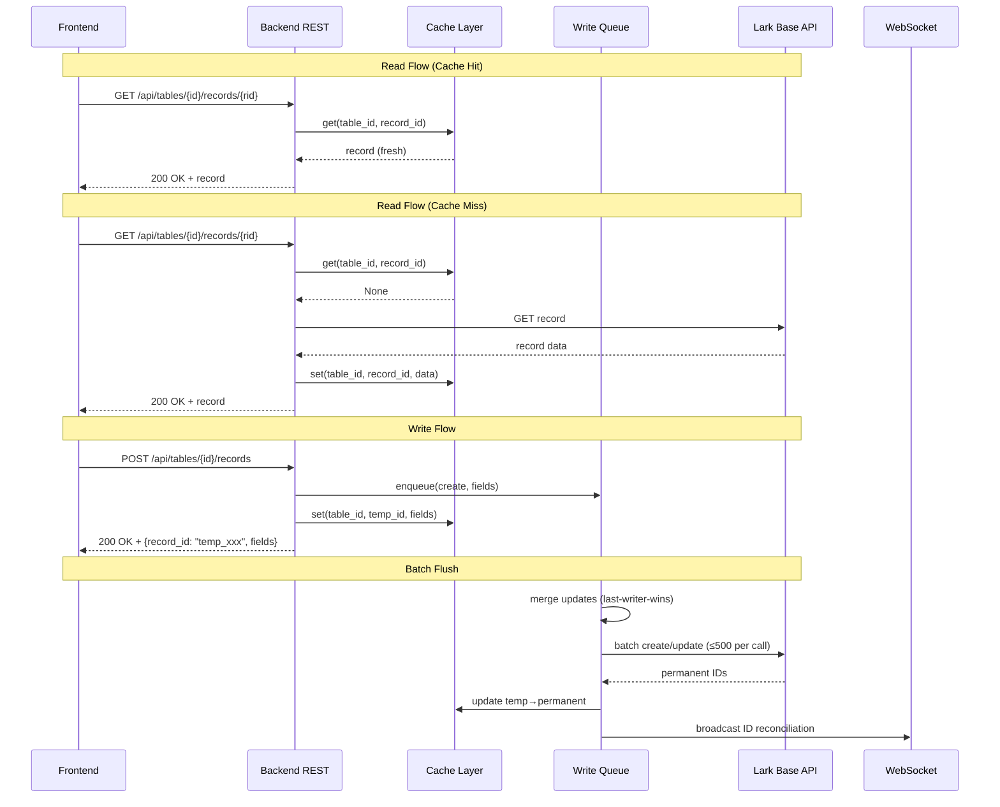

# Design Document: API Request Caching

## Overview

This feature introduces a backend caching and write-batching layer into the existing FastAPI server, transforming it from a WebSocket-only relay into the single gateway for all Lark Base data operations. The architecture follows a **read-through cache with stale-while-revalidate** pattern for reads, and a **write queue with periodic batch flush** for writes. The frontend is migrated to call backend REST endpoints while preserving existing `lark-api.service.ts` function signatures.

### Design Goals

- Reduce Lark Base API quota consumption from thousands of calls/hour to under 500
- Maintain sub-200ms response times for cached reads and optimistic writes
- Keep data fresh via TTL expiration and webhook-driven cache invalidation
- Preserve the existing frontend service interface for minimal migration effort

### Key Design Decisions

| Decision | Rationale |
|----------|-----------|
| In-memory cache (dict-based) over Redis | Single-instance deployment, no infra overhead, sub-ms access |
| Stale-while-revalidate over strict TTL | Better UX — users never wait for refresh if stale data exists |
| Last-writer-wins merge over conflict detection | Matches Lark's own semantics, simpler implementation |
| Shared secret auth over JWT | Simple internal service-to-service auth, no token rotation needed |
| Background asyncio task for flush over Celery | No external broker needed, fits existing lifespan pattern |

## Architecture

### High-Level System Architecture



### Request Flow



## Components and Interfaces

### Backend Components

#### 1. Cache Layer (`backend/app/services/cache.py`)

The in-memory cache storing Lark Base records indexed by `(table_id, record_id)`.

```python
# ─── Public Interface ───────────────────────────────────────────────────────

def create_cache(settings: Settings) -> CacheStore:
    """Factory function to create an initialized CacheStore."""

class CacheStore:
    """In-memory cache with TTL, eviction, and stale-while-revalidate support."""

    def get(self, table_id: str, record_id: str) -> CacheEntry | None: ...
    def get_all(self, table_id: str) -> list[CacheEntry] | None: ...
    def set(self, table_id: str, record_id: str, fields: dict) -> None: ...
    def set_bulk(self, table_id: str, records: list[dict]) -> None: ...
    def remove(self, table_id: str, record_id: str) -> None: ...
    def is_fresh(self, table_id: str, record_id: str) -> bool: ...
    def is_table_fully_cached(self, table_id: str) -> bool: ...
    def mark_table_fully_cached(self, table_id: str) -> None: ...
    def has_pending_fetch(self, record_id: str) -> bool: ...
    def mark_pending_fetch(self, table_id: str, record_id: str) -> None: ...
    def clear_pending_fetch(self, table_id: str, record_id: str) -> None: ...
```

#### 2. Write Queue (`backend/app/services/write_queue.py`)

Ordered queue of pending create/update operations with merge capability.

```python
# ─── Public Interface ───────────────────────────────────────────────────────

class WriteOperation(BaseModel):
    """A single pending write operation."""
    op_type: Literal["create", "update"]
    table_id: str
    record_id: str  # temp_xxx for creates, real ID for updates
    fields: dict
    submitted_at: float  # time.time()
    fail_count: int = 0

class WriteQueue:
    """Thread-safe write queue with per-table ordering."""

    def enqueue(self, operation: WriteOperation) -> bool: ...
    def drain(self, table_id: str) -> list[WriteOperation]: ...
    def size(self, table_id: str | None = None) -> int: ...
    def has_pending(self, record_id: str) -> bool: ...
    def merge_updates(self, operations: list[WriteOperation]) -> list[WriteOperation]: ...
    def return_failed(self, operations: list[WriteOperation]) -> None: ...
    def move_to_dead_letter(self, operation: WriteOperation) -> None: ...
```

#### 3. Batch Flush Scheduler (`backend/app/services/flush_scheduler.py`)

Background asyncio task that periodically drains and flushes the write queue.

```python
# ─── Public Interface ───────────────────────────────────────────────────────

class FlushScheduler:
    """Periodic batch flush of the write queue to Lark Base API."""

    def __init__(self, queue: WriteQueue, cache: CacheStore, 
                 lark_client: LarkClient, settings: Settings): ...
    async def start(self) -> None: ...
    async def stop(self) -> None: ...
    async def flush_once(self) -> FlushResult: ...
```

#### 4. Lark API Client (`backend/app/services/lark_client.py`)

Server-side HTTP client for Lark Base API operations with token management.

```python
# ─── Public Interface ───────────────────────────────────────────────────────

class LarkClient:
    """Server-side Lark Base API client with token caching and retry."""

    async def get_record(self, table_id: str, record_id: str) -> dict | None: ...
    async def list_records(self, table_id: str, filter: dict | None = None,
                          sort: list[dict] | None = None) -> list[dict]: ...
    async def batch_create(self, table_id: str, records: list[dict]) -> list[dict]: ...
    async def batch_update(self, table_id: str, records: list[dict]) -> list[dict]: ...
```

#### 5. Webhook Invalidator (`backend/app/services/webhook_invalidator.py`)

Processes webhook events to keep the cache fresh.

```python
# ─── Public Interface ───────────────────────────────────────────────────────

class WebhookInvalidator:
    """Handles cache invalidation based on incoming Lark webhook events."""

    def __init__(self, cache: CacheStore, queue: WriteQueue,
                 lark_client: LarkClient, ws_manager: ConnectionManager): ...
    async def handle_event(self, table_id: str, action_type: str, 
                          record_id: str) -> None: ...
```

#### 6. REST Router (`backend/app/routers/tables.py`)

New REST endpoints for frontend data operations.

```python
# ─── Endpoints ──────────────────────────────────────────────────────────────

# POST /api/tables/{table_id}/records/search
# GET  /api/tables/{table_id}/records/{record_id}
# POST /api/tables/{table_id}/records
# PUT  /api/tables/{table_id}/records/{record_id}
```

### Frontend Components

#### 7. Updated `lark-api.service.ts`

The existing service file is refactored to call backend endpoints instead of Lark directly. Function signatures remain identical.

```typescript
// ─── Interface (unchanged) ──────────────────────────────────────────────────

export function listRecords(tableId: string, filter?: LarkFilter, sort?: LarkSort[]): Promise<LarkRecord[]>;
export function getRecord(tableId: string, recordId: string): Promise<LarkRecord>;
export function createRecord(tableId: string, fields: Record<string, unknown>): Promise<LarkRecord>;
export function updateRecord(tableId: string, recordId: string, fields: Record<string, unknown>): Promise<LarkRecord>;

// ─── Implementation changes ─────────────────────────────────────────────────
// - Base URL changes from Lark API to backend API
// - Authorization header carries shared secret instead of tenant token
// - Retry and timeout logic remains (backend may still be slow on cache miss)
// - extractTextValue/extractNumberValue remain unchanged (data format preserved)
```

#### 8. WebSocket Cache Event Handler (addition to existing WS handling)

```typescript
// New event type: "cache_updated"
// Payload: { table_name: string, record_id: string, action: "created" | "updated" | "deleted" }
// Handler: triggers re-fetch of affected record/list in Zustand store
```

## Data Models

### Cache Entry

```python
from dataclasses import dataclass, field
import time

@dataclass
class CacheEntry:
    """A single cached record with metadata."""
    record_id: str
    fields: dict
    inserted_at: float = field(default_factory=time.time)
    last_refreshed_at: float = field(default_factory=time.time)

    def age_seconds(self) -> float:
        return time.time() - self.last_refreshed_at

    def is_stale(self, ttl_seconds: int) -> bool:
        return self.age_seconds() > ttl_seconds
```

### Table Cache

```python
@dataclass
class TableCache:
    """Cache storage for a single Lark Base table."""
    entries: dict[str, CacheEntry] = field(default_factory=dict)  # record_id → CacheEntry
    ttl_seconds: int = 300
    max_records: int = 10_000
    fully_cached: bool = False
    last_full_fetch_at: float | None = None
    pending_fetches: set[str] = field(default_factory=set)  # record_ids awaiting fetch
```

### Write Operation

```python
class WriteOperation(BaseModel):
    """A pending write operation in the queue."""
    op_type: Literal["create", "update"]
    table_id: str
    record_id: str
    fields: dict
    submitted_at: float
    fail_count: int = 0
```

### Flush Result

```python
class FlushResult(BaseModel):
    """Result of a single flush cycle."""
    table_id: str
    creates_sent: int
    updates_sent: int
    api_calls_made: int
    failed_operations: int
    dead_lettered: int
    id_mappings: dict[str, str]  # temp_id → permanent_id
```

### Dead Letter Entry

```python
class DeadLetterEntry(BaseModel):
    """A write operation that has exhausted retry attempts."""
    operation: WriteOperation
    last_error: str
    dead_lettered_at: float
```

### WebSocket Event Models (additions)

```python
class CacheUpdatedPayload(BaseModel):
    """Payload for cache_updated WebSocket events."""
    table_name: str
    record_id: str
    action: Literal["created", "updated", "deleted"]

class WriteFailedPayload(BaseModel):
    """Payload for write_failed WebSocket events."""
    table_name: str
    record_id: str
    error: str
```

### Configuration (additions to `backend/app/config.py`)

```python
class Settings(BaseSettings):
    # ... existing fields ...
    
    # Cache configuration
    cache_ttl_seconds: int = 300
    cache_max_records_per_table: int = 10_000
    
    # Write queue configuration  
    batch_flush_interval_seconds: int = 10
    write_queue_max_size: int = 1000
    max_flush_retries: int = 3
    batch_size_limit: int = 500
    
    # Lark API credentials (moved from frontend)
    lark_app_id: str = ""
    lark_app_secret: str = ""
    lark_base_app_token: str = ""
    lark_base_url: str = "https://open.larksuite.com/open-apis"
    
    # Table configuration
    configured_tables: str = ""  # comma-separated table_ids
    
    # Frontend auth
    api_shared_secret: str = ""
    
    @validator("cache_ttl_seconds", "batch_flush_interval_seconds")
    def validate_time_range(cls, v):
        if v < 1 or v > 86400:
            raise ValueError("Value must be between 1 and 86400 seconds")
        return v
    
    @property
    def configured_tables_list(self) -> list[str]:
        return [t.strip() for t in self.configured_tables.split(",") if t.strip()]
```

### Frontend Configuration (additions to `src/services/config.ts`)

```typescript
export const BACKEND_CONFIG = {
    baseUrl: import.meta.env.DEV ? 'http://localhost:8000' : import.meta.env.VITE_BACKEND_URL,
    apiSecret: import.meta.env.VITE_API_SHARED_SECRET ?? '',
} as const;
```

## Correctness Properties

*A property is a characteristic or behavior that should hold true across all valid executions of a system — essentially, a formal statement about what the system should do. Properties serve as the bridge between human-readable specifications and machine-verifiable correctness guarantees.*

### Property 1: Cache keyed retrieval

*For any* table ID and record ID pair, if a record is inserted into the cache with those keys, then retrieving with the same (table_id, record_id) pair SHALL return an identical record.

**Validates: Requirements 1.1**

### Property 2: Configuration validation bounds

*For any* integer value for cache TTL or flush interval, the system SHALL accept values in [1, 86400] and reject values outside that range with a configuration error.

**Validates: Requirements 1.3, 7.3**

### Property 3: Fresh records served from cache without API calls

*For any* cached record whose age is less than its table's TTL, a read request for that record SHALL return the cached data without making any Lark Base API call.

**Validates: Requirements 1.4, 2.1, 8.1**

### Property 4: Stale record triggers refresh

*For any* cached record whose age exceeds its table's TTL, when a read is requested, the cache SHALL return the stale record immediately AND trigger an asynchronous refresh that replaces the entry with fresh data from the Lark Base API.

**Validates: Requirements 1.5, 2.7**

### Property 5: Failed refresh preserves stale data

*For any* cached record where a TTL-triggered refresh fails (network error, non-success response), the cache SHALL continue serving the existing stale record and SHALL retry on the next read.

**Validates: Requirements 1.6**

### Property 6: Cache eviction at capacity

*For any* table cache containing exactly 10,000 records, inserting an additional record SHALL evict the record with the greatest age (oldest `last_refreshed_at`), maintaining the invariant that record count never exceeds 10,000.

**Validates: Requirements 1.7**

### Property 7: Read-through on cache miss

*For any* record ID not present in the cache, a read request SHALL fetch the record from the Lark Base API, store it in the cache, and return it — such that an immediately subsequent read returns the same record from cache without an API call.

**Validates: Requirements 2.2**

### Property 8: Write queue preserves submission order

*For any* sequence of N write operations submitted to the same table, draining the queue SHALL return those operations in the exact order they were submitted.

**Validates: Requirements 3.2**

### Property 9: Last-writer-wins field merge

*For any* sequence of update operations targeting the same record, merging them SHALL produce a single update where each field's value equals the value from the most recently submitted operation that modifies that field.

**Validates: Requirements 3.4**

### Property 10: Batch splitting at 500

*For any* set of N pending operations for a table (N > 0), the flush scheduler SHALL split them into ⌈N/500⌉ API calls, each containing at most 500 records.

**Validates: Requirements 3.5**

### Property 11: Failed flush retains operations

*For any* batch flush that receives an HTTP 5xx or network timeout, ALL operations in the failed batch SHALL remain in the write queue with their fail_count incremented by 1.

**Validates: Requirements 3.6**

### Property 12: Dead-letter after three consecutive failures

*For any* write operation whose fail_count reaches 3, the operation SHALL be moved to the dead-letter log and SHALL NOT appear in subsequent queue drains.

**Validates: Requirements 3.7**

### Property 13: Webhook invalidates cached records

*For any* record_id present in the cache, when a webhook event with action_type "record_changed" or a record-deleted event arrives for that record_id, the record SHALL be removed from the cache such that subsequent reads trigger a fresh fetch.

**Validates: Requirements 4.1, 4.3**

### Property 14: Webhook create inserts into cache

*For any* webhook event with action_type "record_created" where the Lark Base API returns valid record data, the record SHALL be inserted into the cache within 5 seconds of event receipt.

**Validates: Requirements 4.2**

### Property 15: Webhook broadcast on cache update

*For any* cache modification triggered by a webhook event, the system SHALL broadcast a WebSocket event containing the table_name, record_id, and action to all connected clients.

**Validates: Requirements 4.5**

### Property 16: Webhook discarded for pending writes

*For any* webhook event targeting a record_id that has a pending operation in the write queue, the webhook-triggered cache update SHALL be discarded (cache entry remains unchanged).

**Validates: Requirements 4.6**

### Property 17: Search returns at most 500 records

*For any* search request on a table with N cached records (N ≥ 0), the response SHALL contain at most 500 records regardless of how many match the filter.

**Validates: Requirements 5.1**

### Property 18: Create returns temp-prefixed ID

*For any* valid create request with arbitrary field data, the response SHALL contain a record_id that starts with "temp_" and fields that match the submitted input.

**Validates: Requirements 5.4**

### Property 19: Update returns optimistically merged record

*For any* update request with fields F applied to an existing cached record with fields E, the response SHALL contain fields equal to {**E, **F} (the merge of existing fields overwritten by submitted fields).

**Validates: Requirements 5.5**

### Property 20: Batch flush sends at most one create and one update call per table

*For any* flush cycle containing mixed create and update operations for a single table, the scheduler SHALL produce exactly one batch-create call and exactly one batch-update call (each potentially split at 500 records), regardless of the number of individual operations.

**Validates: Requirements 8.2**

## Error Handling

### Backend Error Handling

| Scenario | Behavior | HTTP Status |
|----------|----------|-------------|
| Lark API unreachable on cache miss | Return HTTP 502 with "upstream service unavailable" | 502 |
| Lark API returns 404 for record | Return HTTP 404 with "record not found" | 404 |
| Lark API unreachable on stale refresh | Serve stale data, log warning, retry next read | 200 (stale) |
| Write queue full (≥1000 ops) | Reject with HTTP 503 "queue full, try later" | 503 |
| Invalid/missing auth token | Return HTTP 401 "authentication required" | 401 |
| Unknown table_id | Return HTTP 404 "table not recognized" | 404 |
| Batch flush 5xx from Lark | Retain in queue, increment fail_count, retry next cycle | — |
| Operation dead-lettered (3 failures) | Move to dead-letter log, notify via WebSocket | — |
| Webhook fetch fails for new record | Mark pending-fetch, retry within 30s | — |
| Config validation failure | Reject startup with descriptive error message | — |

### Frontend Error Handling

| Scenario | Behavior |
|----------|----------|
| Backend returns 502 or unreachable | Show error banner, retry once after 3 seconds |
| Backend returns 401 | Likely config issue — log error, show connectivity warning |
| Backend returns 404 for record | Propagate as before (record genuinely missing) |
| Backend returns 503 (queue full) | Show transient warning, retry after flush interval |
| WebSocket disconnection | Existing reconnection logic applies; trigger full re-fetch on reconnect |

### Dead-Letter Handling

Operations that fail 3 consecutive flush cycles are:
1. Moved to an in-memory dead-letter list (logged at ERROR level)
2. Broadcast to frontend via WebSocket `write_failed` event
3. Frontend shows a notification indicating which record failed to save
4. Dead-letter entries are kept for operator inspection (future: expose via admin endpoint)

## Testing Strategy

### Backend Testing

**Framework**: `pytest` + `pytest-asyncio` + `hypothesis` (already in requirements.txt)

#### Property-Based Tests (hypothesis)

Each correctness property maps to a property-based test with minimum 100 iterations:

| Property | Test File | Generator Strategy |
|----------|-----------|-------------------|
| 1: Keyed retrieval | `tests/test_cache_properties.py` | Random table_ids (text), record_ids (text), field dicts |
| 2: Config validation | `tests/test_config_properties.py` | Random integers across full int range |
| 3: Fresh cache hit | `tests/test_cache_properties.py` | Records with age < TTL |
| 4: Stale triggers refresh | `tests/test_cache_properties.py` | Records with age > TTL, mocked API |
| 5: Failed refresh stale | `tests/test_cache_properties.py` | Random failure modes |
| 6: Eviction at capacity | `tests/test_cache_properties.py` | 10001+ records with random ages |
| 7: Read-through | `tests/test_cache_properties.py` | Random record_ids not in cache |
| 8: Queue order | `tests/test_write_queue_properties.py` | Random operation sequences |
| 9: Last-writer-wins | `tests/test_write_queue_properties.py` | Random field update sequences |
| 10: Batch splitting | `tests/test_flush_properties.py` | Random N in [1, 2000] |
| 11: Failed flush retains | `tests/test_flush_properties.py` | Random ops with mocked failures |
| 12: Dead-letter | `tests/test_flush_properties.py` | Ops with fail_count sequences |
| 13: Webhook invalidation | `tests/test_webhook_invalidator_properties.py` | Random record_ids in cache |
| 14: Webhook create | `tests/test_webhook_invalidator_properties.py` | Random create events |
| 15: Webhook broadcast | `tests/test_webhook_invalidator_properties.py` | Random events |
| 16: Webhook skip pending | `tests/test_webhook_invalidator_properties.py` | Records with pending ops |
| 17: Search limit 500 | `tests/test_tables_router_properties.py` | Caches with >500 records |
| 18: Temp ID prefix | `tests/test_tables_router_properties.py` | Random field dicts |
| 19: Optimistic merge | `tests/test_tables_router_properties.py` | Random existing + update fields |
| 20: One batch call per type | `tests/test_flush_properties.py` | Mixed create/update ops |

**Property test configuration**: Each test uses `@given(...)` with `@settings(max_examples=100)`.

**Tag format**: Each test is annotated with:
```python
# Feature: api-request-caching, Property {N}: {property_text}
```

#### Unit Tests (example-based)

- HTTP 502 on Lark timeout during cache miss
- HTTP 404 on record not found
- HTTP 401 on missing/invalid auth token
- HTTP 404 on unknown table_id
- HTTP 503 on queue full
- Full-table fetch behavior
- Stale-while-revalidate async refresh spawning

#### Integration Tests

- Scheduler fires at configured interval
- Concurrent writes during flush don't block
- End-to-end: submit write → flush → verify Lark called
- Webhook → cache invalidation → WebSocket broadcast pipeline

### Frontend Testing

**Framework**: `vitest` + `fast-check` (already configured)

#### Property-Based Tests (fast-check)

| Test | Strategy |
|------|----------|
| `extractTextValue` / `extractNumberValue` remain correct | Random Lark field value shapes |
| Optimistic store update preserves other state | Random store states + optimistic writes |
| Temp ID replacement in store | Random temp/permanent ID pairs |

**Configuration**: `fc.assert(prop, { numRuns: 100 })`

#### Unit Tests

- `lark-api.service.ts` calls backend URL (not Lark directly)
- Authorization header includes shared secret
- Error banner shown on 502
- Retry after 3 seconds on failure
- WebSocket `cache_updated` event triggers re-fetch
- WebSocket `write_failed` event shows notification
- Temp ID → permanent ID reconciliation in Zustand store

### Test Organization

```
backend/tests/
├── test_cache_properties.py          # Properties 1-7
├── test_write_queue_properties.py    # Properties 8-9
├── test_flush_properties.py          # Properties 10-12, 20
├── test_webhook_invalidator_properties.py  # Properties 13-16
├── test_tables_router_properties.py  # Properties 17-19
├── test_tables_router.py            # Unit tests for REST endpoints
├── test_lark_client.py              # Unit tests for Lark HTTP client
└── test_config_properties.py        # Property 2

src/services/__tests__/
├── lark-api.service.test.ts          # Migration verification
└── cache-events.test.ts              # WebSocket event handling
```
