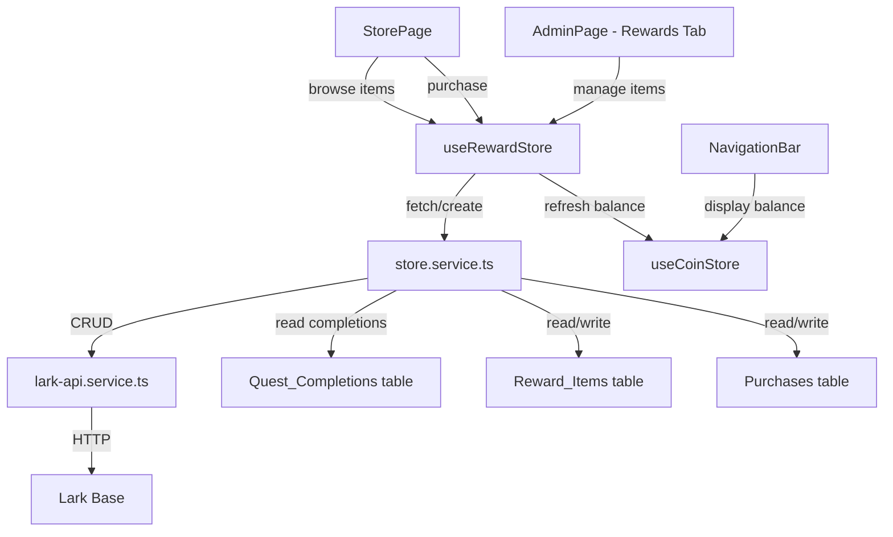
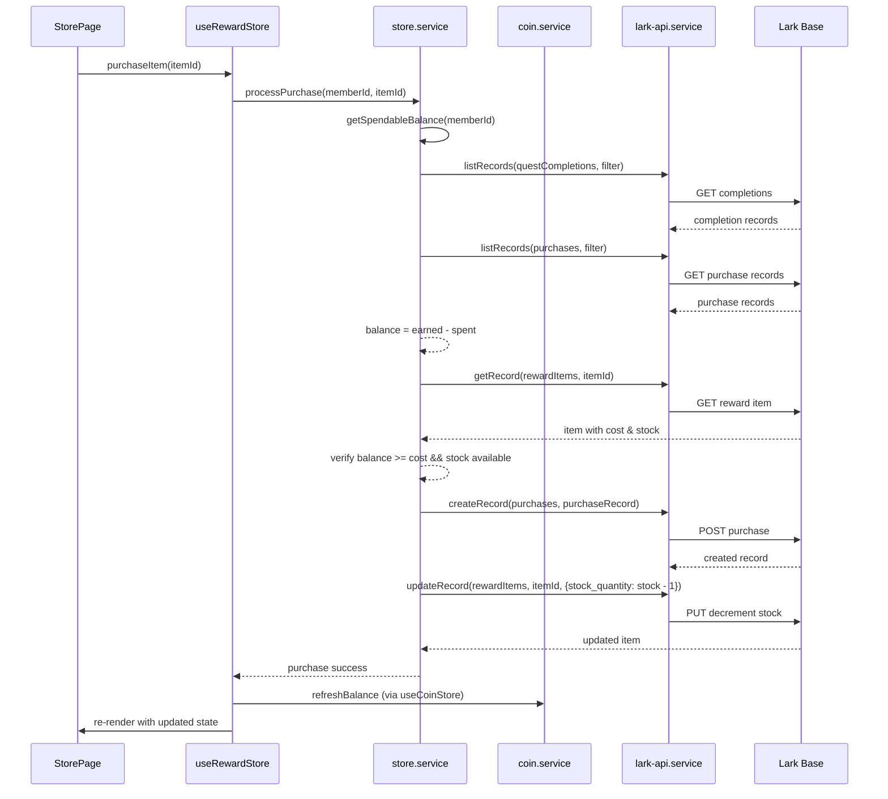

# Design Document: Coin Spending Store

## Overview

The Coin Spending Store adds a reward redemption layer to the existing coin-earning system. Members browse a catalog of reward items, spend accumulated coins on purchases, and review their purchase history. Admins manage the catalog — creating, editing, deactivating, and restocking reward items.

The system introduces three main concerns:

1. **Store Service** — handles reward item CRUD, purchase processing with balance verification and stock management, purchase history retrieval, and balance calculation that accounts for spending.
2. **Reward Store (Zustand)** — `useRewardStore` manages reward items, purchase state, and purchase history independently from the existing `useCoinStore`.
3. **UI Layer** — a `/store` route with item browsing, purchase flow with confirmation dialog, and purchase history; plus an admin panel tab for reward item management.

The architecture preserves the frontend-only pattern: all CRUD goes through `lark-api.service.ts`, state lives in Zustand, and the UI is composed of React components consuming store selectors.



### Data Flow: Purchase Transaction



## Architecture

### Module Decomposition

| Module | Responsibility | Location |
|--------|---------------|----------|
| `store.service.ts` | Reward item CRUD, purchase processing, balance calculation with spending, purchase history | `src/services/store.service.ts` |
| `reward.store.ts` | Zustand store for reward items, purchase state, purchase history | `src/store/reward.store.ts` |
| `StorePage.tsx` | Route-level page for the spending store | `src/pages/StorePage.tsx` |
| `RewardItemCard.tsx` | Individual reward item display card | `src/components/store/RewardItemCard.tsx` |
| `PurchaseConfirmDialog.tsx` | Confirmation dialog before purchase | `src/components/store/PurchaseConfirmDialog.tsx` |
| `PurchaseHistory.tsx` | Purchase history list view | `src/components/store/PurchaseHistory.tsx` |
| `RewardAdminPanel.tsx` | Admin reward item management panel | `src/components/admin/RewardAdminPanel.tsx` |
| `RewardItemForm.tsx` | Create/edit form for reward items | `src/components/admin/RewardItemForm.tsx` |

### Integration Points

- **`coin.service.ts` (existing)** — `getCoinBalance` currently only sums `coins_awarded`. The new `store.service.ts` provides `getSpendableBalance` which subtracts purchases. The existing `getCoinBalance` is NOT modified — instead, `useCoinStore` is updated to call the new balance function.
- **`useCoinStore` (existing)** — The `fetchBalance` and `refreshBalance` actions are updated to use the new spending-aware balance calculation from `store.service.ts`.
- **`config.ts` (existing)** — Extended with `TABLE_IDS.rewardItems` and `TABLE_IDS.purchases`.
- **`types/index.ts` (existing)** — Extended with `RewardItem`, `PurchaseRecord`, and related interfaces.
- **`App.tsx` (existing)** — Adds `/store` route within the `AuthGuard`/`AppShell` layout.
- **`AdminPage.tsx` (existing)** — Adds a "Rewards" tab containing `RewardAdminPanel`.

### Key Design Decisions

1. **Separate balance calculation**: Rather than modifying `coin.service.ts`, a new `getSpendableBalance` function in `store.service.ts` computes `earned - spent`. This avoids breaking the existing earning system.
2. **Atomic purchase**: The purchase creates the `Purchase_Record` first, then decrements stock. If stock decrement fails, the purchase record exists but stock is inconsistent — an acceptable tradeoff since stock can be corrected by admins and the coin deduction is the critical path.
3. **Re-verification at purchase time**: Stock and balance are re-checked at purchase confirmation, not at page load, to handle concurrent purchases.
4. **Unlimited stock (-1)**: Items with `stock_quantity = -1` skip stock checks and decrement logic entirely.

## Components and Interfaces

### store.service.ts

```typescript
import type { RewardItem, PurchaseRecord, LarkFilter } from '../types';

// ─── Reward Item CRUD ───────────────────────────────────────────────────────

/** Lists all active reward items (is_active = true), sorted by cost ascending. */
export async function getActiveRewardItems(): Promise<RewardItem[]>;

/** Lists all reward items (active and inactive) for admin view. */
export async function getAllRewardItems(): Promise<RewardItem[]>;

/** Creates a new reward item in Lark Base. */
export async function createRewardItem(item: Omit<RewardItem, 'itemId'>): Promise<RewardItem>;

/** Updates an existing reward item in Lark Base. */
export async function updateRewardItem(itemId: string, fields: Partial<Omit<RewardItem, 'itemId'>>): Promise<RewardItem>;

/** Deactivates a reward item (sets is_active = false). */
export async function deactivateRewardItem(itemId: string): Promise<void>;

// ─── Balance Calculation ────────────────────────────────────────────────────

/** Calculates spendable balance: sum(coins_awarded) - sum(coins_spent). Minimum 0. */
export async function getSpendableBalance(memberId: string): Promise<number>;

// ─── Purchase Processing ────────────────────────────────────────────────────

/** Processes a purchase: verifies balance, checks stock, creates record, decrements stock. */
export async function processPurchase(memberId: string, itemId: string): Promise<PurchaseRecord>;

// ─── Purchase History ───────────────────────────────────────────────────────

/** Retrieves purchase history for a member, sorted by date descending. */
export async function getPurchaseHistory(memberId: string): Promise<PurchaseRecord[]>;
```

### reward.store.ts (Zustand)

```typescript
import { create } from 'zustand';
import type { RewardItem, PurchaseRecord } from '../types';

// ─── Store State Interface ──────────────────────────────────────────────────

export interface RewardState {
  // Data
  rewardItems: RewardItem[];
  purchaseHistory: PurchaseRecord[];
  
  // Loading states (per operation)
  itemsLoading: boolean;
  purchaseLoading: boolean;
  historyLoading: boolean;
  
  // Error states (per operation)
  itemsError: string | null;
  purchaseError: string | null;
  historyError: string | null;
  
  // Purchase success feedback
  lastPurchase: PurchaseRecord | null;

  // Actions
  fetchRewardItems: () => Promise<void>;
  fetchAllRewardItems: () => Promise<void>; // admin
  purchaseItem: (memberId: string, itemId: string) => Promise<void>;
  fetchPurchaseHistory: (memberId: string) => Promise<void>;
  clearPurchaseError: () => void;
  clearLastPurchase: () => void;
}
```

### New Types (additions to `types/index.ts`)

```typescript
// ─── Reward Store Types ─────────────────────────────────────────────────────

export interface RewardItem {
  itemId: string;
  title: string;
  description: string;
  cost: number;
  imageUrl: string | null;
  stockQuantity: number; // -1 for unlimited, 0+ for finite
  isActive: boolean;
}

export interface PurchaseRecord {
  purchaseId: string;
  memberId: string;
  rewardItemId: string;
  rewardItemTitle: string; // denormalized for history display
  coinsSpent: number;
  purchasedAt: number; // Unix timestamp in milliseconds
}
```

### Validation Functions (additions to `utils/validation.ts`)

```typescript
/** Validates reward item title: 1–100 characters, not whitespace-only. */
export function validateRewardItemTitle(title: string): ValidationResult;

/** Validates reward item description: 0–500 characters. */
export function validateRewardItemDescription(description: string): ValidationResult;

/** Validates reward item cost: positive integer between 1 and 100,000. */
export function validateRewardItemCost(value: unknown): ValidationResult;

/** Validates stock quantity: -1 (unlimited) or positive integer > 0. */
export function validateStockQuantity(value: unknown): ValidationResult;

/** Validates image URL: empty string (optional) or valid URL format. */
export function validateImageUrl(url: string): ValidationResult;
```

### UI Components

#### StorePage.tsx
- Route: `/store`
- Protected by `AuthGuard` — accessible to all authenticated members
- Layout: Coin balance header → Reward item grid → Purchase history section
- Dispatches `fetchRewardItems` and `fetchPurchaseHistory` on mount
- Reads balance from `useCoinStore`

#### RewardItemCard.tsx
- Displays: title, truncated description (150 chars), cost, image or placeholder, stock indicator
- Visual states: purchasable (balance >= cost and in stock), insufficient coins (grayed), out of stock (disabled with label)
- Unlimited stock items show no stock count; finite stock shows remaining count
- Click triggers purchase confirmation dialog

#### PurchaseConfirmDialog.tsx
- Shows: item title, coin cost, current balance, balance after purchase
- Confirm/Cancel buttons
- Displays error messages on failure (insufficient coins, out of stock)
- Shows loading spinner during purchase processing

#### PurchaseHistory.tsx
- Lists purchase records: reward item title, coins spent, purchase date
- Sorted most recent first
- Empty state message when no purchases
- Error state with retry button on fetch failure

#### RewardAdminPanel.tsx
- Integrated as tab in existing AdminPage
- Lists all reward items with title, cost, stock, active status
- Actions: create new, edit, deactivate
- Uses `RewardItemForm` for create/edit

#### RewardItemForm.tsx
- Fields: title, description, cost, image URL (optional), stock quantity
- Inline validation errors
- Preserves form values on API failure
- Supports both create and edit modes

## Data Models

### New Lark Base Tables

#### Reward_Items Table

| Field | Type | Constraints | Description |
|-------|------|-------------|-------------|
| `title` | Text | Required, 1–100 chars | Reward item display name |
| `description` | Text | Optional, 0–500 chars | Item description |
| `cost` | Number | Required, 1–100,000 | Coin cost to purchase |
| `image_url` | Text | Optional | URL to item image |
| `stock_quantity` | Number | Required, -1 or > 0 | Available stock (-1 = unlimited) |
| `is_active` | Boolean | Default: true | Whether item appears in member store |

#### Purchases Table

| Field | Type | Constraints | Description |
|-------|------|-------------|-------------|
| `member_id` | Text | Required | Purchasing member's record ID |
| `reward_item_id` | Text | Required | Purchased item's record ID |
| `reward_item_title` | Text | Required | Item title at time of purchase (denormalized) |
| `coins_spent` | Number | Required, positive integer | Coins deducted for this purchase |
| `purchased_at` | Number | Required | Unix timestamp in milliseconds |

### Config Extension (TABLE_IDS)

```typescript
export const TABLE_IDS = {
  // ... existing ...
  rewardItems: 'tbl_REWARD_ITEMS_ID',
  purchases: 'tbl_PURCHASES_ID',
} as const;
```

### Route Extension

```typescript
// In App.tsx routes (within AuthGuard > AppShell)
<Route path="/store" element={<StorePage />} />
```


## Correctness Properties

*A property is a characteristic or behavior that should hold true across all valid executions of a system — essentially, a formal statement about what the system should do. Properties serve as the bridge between human-readable specifications and machine-verifiable correctness guarantees.*

### Property 1: Spendable balance is non-negative difference of earned minus spent

*For any* array of `coins_awarded` values (non-negative integers) from Quest_Completions and any array of `coins_spent` values (positive integers) from Purchase_Records, `getSpendableBalance(memberId)` SHALL return `max(0, sum(coins_awarded) - sum(coins_spent))`. The result SHALL always be ≥ 0, including when total spent exceeds total earned, and SHALL be 0 when the member has no records.

**Validates: Requirements 4.1, 4.2**

### Property 2: Purchasability classification

*For any* member balance (non-negative integer), item cost (positive integer 1–100,000), and stock quantity (integer: -1 or ≥ 0), an item SHALL be classified as purchasable if and only if `balance >= cost` AND (`stockQuantity === -1` OR `stockQuantity > 0`). For all other combinations, the item SHALL be classified as non-purchasable.

**Validates: Requirements 2.3, 2.4, 2.6, 3.2, 3.3, 3.8**

### Property 3: Description truncation at 150 characters

*For any* string, the description truncation function SHALL return the original string unchanged if its length is ≤ 150 characters. For strings longer than 150 characters, it SHALL return exactly the first 150 characters followed by an ellipsis ("…"). The output length SHALL never exceed 151 characters (150 + single ellipsis character).

**Validates: Requirements 2.1**

### Property 4: Reward items sorted by cost ascending

*For any* array of RewardItem objects, `getActiveRewardItems()` SHALL return them sorted in non-decreasing order by the `cost` field. For items with equal cost, the relative order is stable. The output array SHALL contain only items where `isActive === true` and SHALL contain no duplicates or additions beyond the source data.

**Validates: Requirements 2.5, 7.4**

### Property 5: Purchase record preserves transaction data and decrements stock

*For any* valid purchase (where balance ≥ cost and stock is available), the created Purchase_Record SHALL contain the exact `memberId`, `rewardItemId`, and `coinsSpent` equal to the item's `cost` at time of purchase, with a `purchasedAt` timestamp within a reasonable window of the current time. Additionally, for items with positive `stockQuantity`, the item's stock SHALL be decremented by exactly 1 after the purchase.

**Validates: Requirements 3.4, 3.6**

### Property 6: Purchase history sorted by date descending

*For any* array of PurchaseRecord objects, `getPurchaseHistory(memberId)` SHALL return them sorted in strictly non-increasing order by the `purchasedAt` timestamp field (most recent first). The output SHALL contain exactly the same records as the input with no additions, removals, or field mutations.

**Validates: Requirements 5.2, 5.3**

### Property 7: Reward item field validation

*For any* string input, reward item title validation SHALL accept strings with 1–100 characters that are not whitespace-only, and reject empty strings, whitespace-only strings, and strings exceeding 100 characters. Reward item description validation SHALL accept strings with 0–500 characters (including empty) and reject strings exceeding 500 characters. Cost validation SHALL accept positive integers in range [1, 100000] and reject all other values. Stock quantity validation SHALL accept -1 and any positive integer > 0, and reject 0, negative values other than -1, and non-integers.

**Validates: Requirements 6.3, 6.4**

### Property 8: Active items filtering excludes inactive items

*For any* set of RewardItem records with mixed `isActive` values, `getActiveRewardItems()` SHALL return only items where `isActive === true`. The count of returned items SHALL equal the count of active items in the input set. No inactive item SHALL appear in the result.

**Validates: Requirements 7.4**

## Error Handling

### Store Service Errors

| Error Scenario | Handling |
|---------------|----------|
| Balance fetch fails (purchase records) | Retry via `withRetry()` (3 attempts). If all fail, return last known balance from store state. Never return negative. |
| Balance fetch fails (quest completions) | Same retry + fallback as above. |
| Purchase record creation fails | Throw immediately. Do NOT decrement stock. Return error to caller. Store shows error message. |
| Stock decrement fails (after purchase record created) | Log warning. Purchase is considered successful (record exists). Stock inconsistency can be corrected by admin. |
| Reward items fetch fails | Throw to caller. Store sets `itemsError`. UI shows error banner with retry. |
| Purchase history fetch fails | Throw to caller. Store sets `historyError`. UI shows error with retry option. |
| Reward item creation/update fails (admin) | Throw to caller. Admin panel shows error banner. Form values preserved. |
| Concurrent stock depletion (stock = 0 at purchase time) | `processPurchase` re-reads item before creating record. If stock is 0 (and not -1), rejects with "Item is no longer available" error. |
| Insufficient balance at purchase time | `processPurchase` computes fresh balance. If < cost, rejects with "Insufficient coins" error. Does not create any records. |

### Error State Management in Store

```typescript
// Each async operation has independent error state
{
  itemsError: string | null;    // Set on fetchRewardItems failure
  purchaseError: string | null; // Set on purchaseItem failure (cleared on next attempt)
  historyError: string | null;  // Set on fetchPurchaseHistory failure
}
```

### Resilience Patterns

- **Retry**: All Lark API calls use `withRetry()` (3 attempts) from `auth.service.ts`.
- **Fallback balance**: If purchase record fetch fails during balance calculation, fall back to last known balance from `useCoinStore` state rather than blocking the page.
- **Optimistic deactivation**: Admin deactivation updates local state immediately, rolls back on API failure.
- **Non-blocking stock display**: If stock count can't be refreshed after a purchase by another user, the stale value is shown until next page load.

## Testing Strategy

### Property-Based Tests (fast-check, minimum 100 iterations)

| Property | Module Under Test | Key Generators |
|----------|------------------|----------------|
| 1: Spendable balance | `store.service.ts` | `fc.array(fc.nat({max: 10000}))` for awarded, `fc.array(fc.integer({min: 1, max: 10000}))` for spent |
| 2: Purchasability classification | `utils/store-helpers.ts` | `fc.nat({max: 200000})` for balance, `fc.integer({min: 1, max: 100000})` for cost, `fc.oneof(fc.constant(-1), fc.nat({max: 100}))` for stock |
| 3: Description truncation | `utils/formatting.ts` | `fc.string({minLength: 0, maxLength: 500})` |
| 4: Items sorted by cost | `store.service.ts` | `fc.array(fc.record({cost: fc.integer({min: 1, max: 100000}), isActive: fc.boolean(), ...}))` |
| 5: Purchase record correctness | `store.service.ts` | `fc.record({memberId: fc.string({minLength:1}), cost: fc.integer({min:1, max:100000}), stock: fc.integer({min:1, max:100})})` |
| 6: History sorted descending | `store.service.ts` | `fc.array(fc.record({purchasedAt: fc.integer({min: 1000000000000, max: 2000000000000}), ...}))` |
| 7: Reward item validation | `utils/validation.ts` | `fc.string({minLength: 0, maxLength: 200})` for title/desc, `fc.oneof(fc.integer(), fc.double(), fc.constant(NaN))` for cost/stock |
| 8: Active filtering | `store.service.ts` | `fc.array(fc.record({isActive: fc.boolean(), ...}))` |

Each property test:
- Lives in `src/services/__tests__/store.service.test.ts` or `src/utils/__tests__/validation.test.ts`
- Uses `fc.assert(fc.property(...), { numRuns: 100 })` minimum
- Is tagged with: `// Feature: coin-spending-store, Property N: <title>`

### Example-Based Unit Tests (Vitest)

| Test Area | Cases |
|-----------|-------|
| StorePage mount | Fetches items and balance on mount |
| RewardItemCard — image placeholder | Renders placeholder when imageUrl is null |
| RewardItemCard — stock display | Shows count for positive stock, hides for -1 |
| RewardItemCard — out of stock | Shows "Out of Stock" label, disables button when stock = 0 |
| PurchaseConfirmDialog | Shows correct remaining balance (balance - cost) |
| PurchaseConfirmDialog error | Shows "Insufficient coins" or "Item no longer available" |
| Purchase flow — API failure | Stock not decremented, error shown, form preserved |
| Purchase flow — balance refresh | After success, useCoinStore.refreshBalance called |
| PurchaseHistory — empty state | Shows empty message when no records |
| PurchaseHistory — error + retry | Error banner and retry button on fetch failure |
| RewardAdminPanel — list all items | Shows active and inactive items |
| RewardAdminPanel — deactivate | Sets is_active = false, item hidden from member view |
| RewardItemForm — validation | Inline errors for invalid title/cost/stock |
| RewardItemForm — edit mode | Pre-populates with existing item data |
| RewardItemForm — API error | Preserves values on save failure |
| Balance fallback | Returns last known balance after 3 retries fail |
| Store page — navigation link | Sidebar contains store link |

### Integration Tests

| Test Area | Approach |
|-----------|----------|
| Full purchase flow | Mock Lark API, verify end-to-end: click buy → confirm → record created → stock decremented → balance refreshed |
| Admin item lifecycle | Create → edit → deactivate → verify hidden from member store |
| Balance across systems | Complete quest (coins earned) → purchase item → verify correct spendable balance |
| Concurrent stock depletion | Simulate stock reaching 0 between page load and confirm |

### Test File Organization

```
src/services/__tests__/
├── store.service.test.ts          # Unit + property tests (Properties 1, 4, 5, 6, 8)

src/utils/__tests__/
├── validation.test.ts             # Extended with Property 7
├── formatting.test.ts             # Extended with Property 3

src/store/__tests__/
├── reward.store.test.ts           # Store action tests (example-based)

src/components/store/__tests__/
├── RewardItemCard.test.tsx         # UI component tests
├── PurchaseConfirmDialog.test.tsx  # Dialog behavior tests
├── PurchaseHistory.test.tsx        # History display tests

src/components/admin/__tests__/
├── RewardAdminPanel.test.tsx       # Admin panel tests
├── RewardItemForm.test.tsx         # Form validation/submission tests

src/pages/__tests__/
├── StorePage.test.tsx              # Page mount and integration
```
