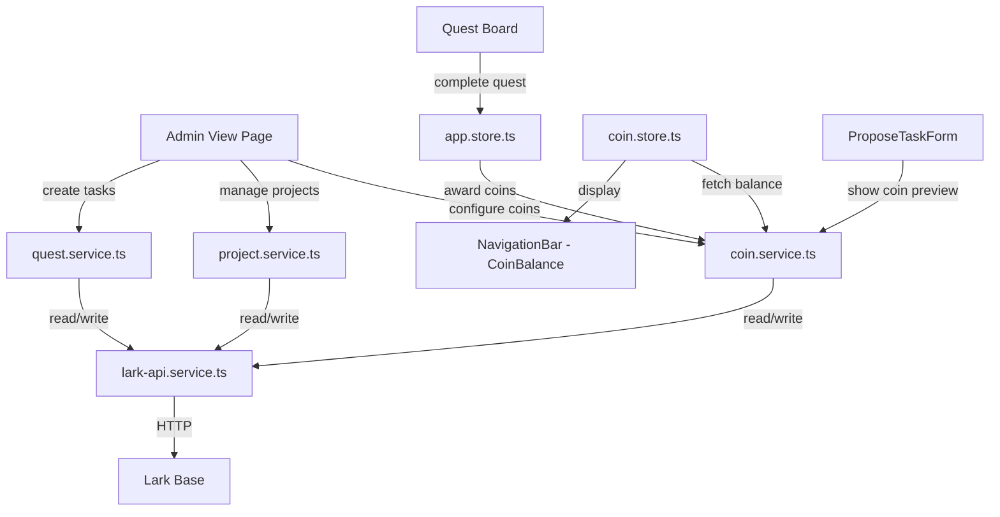
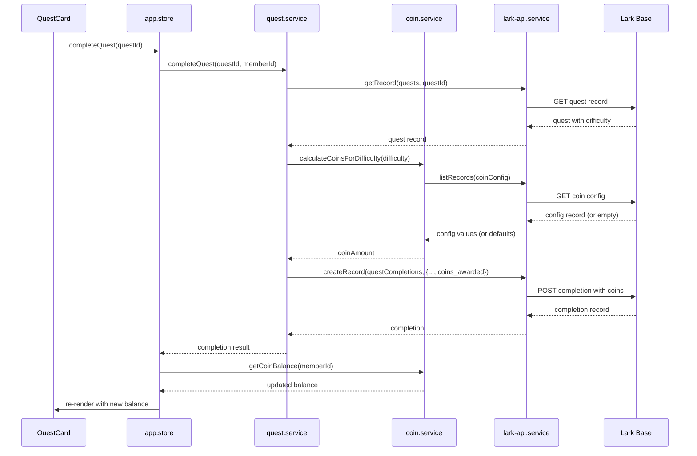

# Design Document: Coin Store System

## Overview

This design introduces a coin-based reward layer on top of the existing badge system. Each quest carries a difficulty rating (`easy`, `medium`, `hard`) that determines how many coins a member earns upon completion. Coin values per difficulty are configurable by admins via a new Admin View page.

The system adds three new domain concerns:

1. **Coin Service** — calculates and awards coins based on quest difficulty + configurable rates, and computes member balances.
2. **Admin View** — a new protected route (`/admin`) for project management, task creation with project scope, and coin configuration.
3. **Data Extensions** — new Lark Base tables (`Coin_Config`, `Projects`) and extended fields on existing tables (`Quests.difficulty`, `Quests.project_ids`, `Quest_Completions.coins_awarded`).

The architecture preserves the existing frontend-only pattern: all CRUD goes through `lark-api.service.ts`, state lives in Zustand stores, and the UI is composed of React components consuming store selectors.



## Architecture

### Module Decomposition

| Module | Responsibility | Location |
|--------|---------------|----------|
| `coin.service.ts` | Coin config retrieval, coin award calculation, balance computation | `src/services/coin.service.ts` |
| `project.service.ts` | Project CRUD, project listing | `src/services/project.service.ts` |
| `coin.store.ts` | Zustand store for coin balance state and actions | `src/store/coin.store.ts` |
| `AdminPage.tsx` | Route-level page for admin features | `src/pages/AdminPage.tsx` |
| `CoinConfigPanel.tsx` | Coin value settings form | `src/components/admin/CoinConfigPanel.tsx` |
| `ProjectList.tsx` | Project listing with quest counts | `src/components/admin/ProjectList.tsx` |
| `ProjectDetail.tsx` | Quest list within a project | `src/components/admin/ProjectDetail.tsx` |
| `AdminTaskForm.tsx` | Task creation form with project scope | `src/components/admin/AdminTaskForm.tsx` |
| `CoinBalance.tsx` | Coin balance display in nav | `src/components/layout/CoinBalance.tsx` |
| `DifficultySelector.tsx` | Reusable difficulty radio/select | `src/components/shared/DifficultySelector.tsx` |

### Integration Points

- **`quest.service.ts` (existing)** — Extended: `completeQuest` now also calls `awardCoinsForCompletion` and persists `coins_awarded` in the completion record. `proposeTask` accepts optional `difficulty` parameter.
- **`app.store.ts` (existing)** — Extended: `completeQuest` action triggers coin balance refresh after completion.
- **`config.ts` (existing)** — Extended: adds `TABLE_IDS.coinConfig` and `TABLE_IDS.projects`.
- **`types/index.ts` (existing)** — Extended: adds `Difficulty`, `CoinConfig`, `Project`, and updates `Quest` and `QuestCompletion`.

### Data Flow: Quest Completion with Coins



## Components and Interfaces

### coin.service.ts

```typescript
import type { Difficulty, CoinConfig } from '../types';

// ─── Constants ──────────────────────────────────────────────────────────────

const DEFAULT_COIN_VALUES: CoinConfig = {
  easy_coins: 1,
  medium_coins: 3,
  hard_coins: 5,
} as const;

// ─── Public API ─────────────────────────────────────────────────────────────

/** Fetches the Coin_Config record from Lark Base. Returns defaults if none exists or on error. */
function getCoinConfig(): Promise<CoinConfig>;

/** Persists updated coin values to Lark Base. Throws on failure. */
function updateCoinConfig(config: CoinConfig): Promise<CoinConfig>;

/** Returns the coin reward for a given difficulty using current config. Falls back to defaults on error. */
function calculateCoinsForDifficulty(difficulty: Difficulty): Promise<number>;

/** Computes a member's total coin balance by summing coins_awarded across all their completions. */
function getCoinBalance(memberId: string): Promise<number>;

/** Awards coins for a quest completion. Returns the coin amount awarded. */
function awardCoinsForCompletion(questId: string, difficulty: Difficulty | null): Promise<number>;
```

### project.service.ts

```typescript
import type { Project } from '../types';

// ─── Public API ─────────────────────────────────────────────────────────────

/** Lists all projects sorted alphabetically by name. */
function listProjects(): Promise<Project[]>;

/** Gets a single project by ID. */
function getProject(projectId: string): Promise<Project>;

/** Creates a new project. */
function createProject(name: string, description: string): Promise<Project>;

/** Gets the quest count for a project (all statuses). */
function getProjectQuestCount(projectId: string): Promise<number>;
```

### coin.store.ts (Zustand)

```typescript
interface CoinState {
  balance: number | null;
  isLoading: boolean;
  error: string | null;
  lastFetchedAt: number | null;

  // Actions
  fetchBalance: (memberId: string) => Promise<void>;
  refreshBalance: (memberId: string) => Promise<void>;
  setBalance: (balance: number) => void;
}
```

### Updated Quest Interface (additions)

```typescript
// Added to existing Quest interface
interface Quest {
  // ... existing fields ...
  difficulty: Difficulty | null;
  projectIds: string[];
}

// Added to existing QuestCompletion interface
interface QuestCompletion {
  // ... existing fields ...
  coinsAwarded: number;
}
```

### New Types

```typescript
type Difficulty = 'easy' | 'medium' | 'hard';

interface CoinConfig {
  easy_coins: number;
  medium_coins: number;
  hard_coins: number;
}

interface Project {
  projectId: string;
  name: string;
  description: string;
}
```

### Validation Functions (additions to utils/validation.ts)

```typescript
/** Validates a coin value is a positive integer between 1 and 10,000. */
function validateCoinValue(value: unknown): ValidationResult;

/** Validates a difficulty string is one of the allowed values. */
function validateDifficulty(value: unknown): ValidationResult;

/** Validates task title for admin creation (1-100 chars, not whitespace-only). */
function validateAdminTaskTitle(title: string): ValidationResult;

/** Validates task description for admin creation (1-500 chars). */
function validateAdminTaskDescription(description: string): ValidationResult;

/** Validates that at least one project is selected. */
function validateProjectSelection(projectIds: string[]): ValidationResult;
```

### UI Components

#### AdminPage.tsx
- Route: `/admin`
- Protected by role check — redirects non-admins to `/quests`
- Tab layout: Projects | Create Task | Coin Settings
- Composes `ProjectList`, `AdminTaskForm`, `CoinConfigPanel`

#### CoinConfigPanel.tsx
- Displays current values for easy/medium/hard in editable number inputs
- Validates each field (1–10,000 positive integer)
- Shows success toast on save, error banner on failure
- Retains form values on save failure

#### ProjectList.tsx
- Lists projects alphabetically with name, truncated description (200 chars), quest count
- Click navigates to project detail view
- Shows empty state message when no projects exist
- Shows error + retry on fetch failure

#### ProjectDetail.tsx
- Lists all quests for the selected project
- Shows title, status badge, assignment type, difficulty label, creation date
- Back navigation to project list

#### AdminTaskForm.tsx
- Fields: title, description, difficulty (radio), target role (agent/developer), project assignment (multi-select or "all")
- Validates all fields before submission
- Creates quest with status `active` and selected difficulty
- Shows success/error feedback

#### CoinBalance.tsx
- Renders in NavigationBar/TopBar area
- Shows coin icon + formatted number with locale thousands separators
- Shows "--" placeholder on fetch failure
- Refreshes on navigation and after quest completion

#### DifficultySelector.tsx
- Three radio options: easy, medium, hard
- Shows coin preview next to each option (fetches from CoinConfig)
- Falls back to default values (1, 3, 5) if config fetch fails
- Reusable in both ProposeTaskForm and AdminTaskForm

## Data Models

### New Tables

#### Coin_Config Table

| Field | Type | Constraints | Description |
|-------|------|-------------|-------------|
| `easy_coins` | Number | 1–10,000 | Coins awarded for easy quests |
| `medium_coins` | Number | 1–10,000 | Coins awarded for medium quests |
| `hard_coins` | Number | 1–10,000 | Coins awarded for hard quests |

Single-record table. Only one configuration row exists at any time.

#### Projects Table

| Field | Type | Constraints | Description |
|-------|------|-------------|-------------|
| `name` | Text | Required | Project name |
| `description` | Text | Optional | Project description |

### Extended Fields

#### Quests Table (additions)

| Field | Type | Description |
|-------|------|-------------|
| `difficulty` | Text | `easy`, `medium`, or `hard`. Nullable — treated as `easy` by Coin_Service when null. |
| `project_ids` | Text | Comma-separated project record IDs |

#### Quest_Completions Table (additions)

| Field | Type | Description |
|-------|------|-------------|
| `coins_awarded` | Number | Coins earned for this completion (minimum 0) |

### Config Extension (TABLE_IDS)

```typescript
export const TABLE_IDS = {
  // ... existing ...
  coinConfig: 'tbl_COIN_CONFIG_ID',
  projects: 'tbl_PROJECTS_ID',
} as const;
```

### Route Extension

```typescript
// In App.tsx routes
<Route path="/admin" element={<AdminGuard><AdminPage /></AdminGuard>} />
```

Where `AdminGuard` checks `currentMember.roles` includes admin privileges and redirects to `/quests` otherwise.

## Correctness Properties

*A property is a characteristic or behavior that should hold true across all valid executions of a system — essentially, a formal statement about what the system should do. Properties serve as the bridge between human-readable specifications and machine-verifiable correctness guarantees.*

### Property 1: Difficulty validation accepts only valid values

*For any* string input, `validateDifficulty(input)` SHALL return valid=true if and only if the input is exactly one of `"easy"`, `"medium"`, or `"hard"`. For all other strings (including empty string, whitespace, mixed case variants, and arbitrary text), it SHALL return valid=false.

**Validates: Requirements 1.1, 1.4**

### Property 2: Coin calculation with config fallback

*For any* difficulty value (including null/empty) and any coin config state (a valid CoinConfig record with values in [1, 10000], or no record at all), `calculateCoinsForDifficulty(difficulty)` SHALL return:
- The config's `easy_coins` value when difficulty is `"easy"` or null/empty
- The config's `medium_coins` value when difficulty is `"medium"`
- The config's `hard_coins` value when difficulty is `"hard"`
- When no config exists or fetch fails: 1 for easy/null, 3 for medium, 5 for hard

The returned value SHALL always be a positive integer ≥ 1.

**Validates: Requirements 1.2, 2.1, 2.2, 3.4, 3.7, 8.4**

### Property 3: Coin balance is non-negative sum of coins_awarded

*For any* array of Quest_Completion records with `coins_awarded` values (non-negative integers), `getCoinBalance(memberId)` SHALL return the sum of all `coins_awarded` values for that member. The result SHALL always be ≥ 0, including when the member has no completions (returns 0).

**Validates: Requirements 2.4**

### Property 4: Completion record includes correct coins_awarded

*For any* quest with a valid difficulty and any coin config state, when `completeQuest` creates a Quest_Completion record, the `coins_awarded` field in the record payload SHALL equal the value returned by `calculateCoinsForDifficulty` for that quest's difficulty. The coins_awarded value SHALL be persisted before the function returns success.

**Validates: Requirements 2.3**

### Property 5: Coin value validation range

*For any* numeric input, `validateCoinValue(input)` SHALL return valid=true if and only if the input is a positive integer in the range [1, 10000] inclusive. For all other values (zero, negative numbers, decimals, NaN, values > 10000, non-numeric types), it SHALL return valid=false.

**Validates: Requirements 3.3, 3.5**

### Property 6: Project list sorted alphabetically

*For any* set of Project records returned from Lark Base, `listProjects()` SHALL return them sorted in case-insensitive alphabetical order by the `name` field. The output array SHALL contain exactly the same projects as the input (no additions, removals, or duplicates).

**Validates: Requirements 4.1**

### Property 7: Description truncation at 200 characters

*For any* string, the truncation function SHALL return the original string unchanged if its length is ≤ 200 characters. For strings longer than 200 characters, it SHALL return exactly the first 200 characters followed by an ellipsis indicator. The output length SHALL never exceed 203 characters (200 + "...").

**Validates: Requirements 4.2**

### Property 8: Admin role access control

*For any* Member object, the admin access check SHALL return true (allow access) if and only if the member's role includes "admin". For all other roles (agent, developer, scrum_master), access SHALL be denied and the application SHALL redirect to the quest board.

**Validates: Requirements 4.4, 4.5**

### Property 9: "All projects" resolves to complete set

*For any* non-empty set of project IDs currently in the Projects table, selecting "all projects" in the admin task form SHALL resolve to an array containing every project ID in the table at the time of form submission. The resulting array SHALL have the same length as the total project count and SHALL contain no duplicates.

**Validates: Requirements 5.3**

### Property 10: Project IDs serialization round-trip

*For any* array of project ID strings (non-empty strings without commas), serializing to the `project_ids` field (comma-separated) and then deserializing back SHALL produce an array with the same IDs in the same order. The serialized string SHALL contain exactly `n-1` commas for `n` project IDs.

**Validates: Requirements 5.6**

### Property 11: Admin task form field validation

*For any* string, admin task title validation SHALL accept strings with 1–100 non-whitespace-only characters and reject empty strings, whitespace-only strings, and strings exceeding 100 characters. Admin task description validation SHALL accept strings with 1–500 characters and reject empty strings and strings exceeding 500 characters.

**Validates: Requirements 5.5, 5.7**

### Property 12: Coin balance formatting

*For any* non-negative integer, the coin balance formatter SHALL produce a string that equals the output of `Intl.NumberFormat` for the user's locale applied to that integer. The formatted string SHALL never be empty and SHALL not contain a negative sign.

**Validates: Requirements 7.3**

## Error Handling

### Coin Service Errors

| Error Type | Handling |
|-----------|----------|
| Coin_Config fetch fails (network/timeout) | Retry via `withRetry()` (3 attempts). On all failures, fall back to defaults (1, 3, 5). Never throw to caller for config reads. |
| Coin_Config update fails | Throw to caller. Admin UI shows error banner, retains form values. |
| coins_awarded persistence fails | Throw immediately. Quest completion is NOT recorded. Caller rolls back optimistic UI. |
| Balance computation fetch fails | Return error state. UI shows "--" placeholder. Last known balance retained in store. |

### Project Service Errors

| Error Type | Handling |
|-----------|----------|
| Projects table fetch fails | Throw to caller. Admin UI shows error banner + retry button. |
| Project creation fails | Throw to caller. Form preserves entered data. |
| Project quest count fetch fails | Show "—" in quest count column. Non-blocking. |

### Admin Task Creation Errors

| Error Type | Handling |
|-----------|----------|
| Validation failure (client-side) | Show inline field-level errors. Prevent submission. |
| Quest record creation fails (API) | Show error banner. Preserve all form values. Do not clear form. |
| Project list fetch fails (for multi-select) | Show error in project selector. Allow retry. |

### Admin View Access Errors

| Error Type | Handling |
|-----------|----------|
| Non-admin navigates to `/admin` | Redirect to `/quests` immediately. No error shown. |
| Role check fetch fails | Redirect to `/quests` (fail-closed). |

### Coin Balance Display Errors

| Error Type | Handling |
|-----------|----------|
| Initial balance fetch fails | Show "--" placeholder. |
| Refresh after completion fails | Retain last known balance in store. Show "--" only if no previous value exists. |
| WebSocket coin update event malformed | Ignore. Wait for next poll/navigation refresh. |

## Testing Strategy

### Property-Based Tests (fast-check, minimum 100 iterations)

| Property | Module Under Test | Key Generators |
|----------|------------------|----------------|
| 1: Difficulty validation | `utils/validation.ts` | `fc.string()`, `fc.constantFrom('easy','medium','hard')` |
| 2: Coin calculation + fallback | `coin.service.ts` | `fc.record({easy_coins: fc.integer(1,10000), ...})`, `fc.option(fc.constantFrom('easy','medium','hard'))` |
| 3: Balance sum | `coin.service.ts` | `fc.array(fc.nat({max: 10000}))` for coins_awarded values |
| 4: Completion includes coins | `quest.service.ts` + `coin.service.ts` | `fc.constantFrom('easy','medium','hard')`, random config |
| 5: Coin value validation | `utils/validation.ts` | `fc.oneof(fc.integer(), fc.double(), fc.constant(NaN), fc.constant(0))` |
| 6: Project list sorting | `project.service.ts` | `fc.array(fc.record({name: fc.string({minLength:1}), ...}))` |
| 7: Description truncation | `utils/formatting.ts` | `fc.string({minLength:0, maxLength:500})` |
| 8: Admin access control | `utils/permissions.ts` | `fc.constantFrom('agent','developer','scrum_master','admin')` |
| 9: All projects resolution | `project.service.ts` | `fc.set(fc.string({minLength:1}))` for project IDs |
| 10: Project IDs round-trip | `coin.service.ts` or `utils` | `fc.array(fc.string({minLength:1}).filter(s => !s.includes(',')))` |
| 11: Admin task validation | `utils/validation.ts` | `fc.string({minLength:0, maxLength:200})` for titles, descriptions |
| 12: Balance formatting | `utils/formatting.ts` | `fc.nat({max: 10_000_000})` |

Each property test:
- Lives in `src/services/__tests__/` or `src/utils/__tests__/` alongside the module
- Uses `fc.assert(fc.property(...), { numRuns: 100 })` minimum
- Is tagged with: `// Feature: coin-store-system, Property N: <title>`

### Example-Based Unit Tests (Vitest)

| Test Area | Cases |
|-----------|-------|
| Quest creation without difficulty | Verify null difficulty persists (not default "easy") |
| DifficultySelector rendering | Each option rendered with correct coin preview |
| CoinConfigPanel save success | Toast shown within 2s, values updated |
| CoinConfigPanel save failure | Error banner, form values preserved |
| ProjectList empty state | Empty message when no projects |
| ProjectList error state | Error banner + retry button |
| ProjectDetail quest listing | All quests for project shown with correct fields |
| AdminTaskForm project multi-select | Single, multi, and "all" selection modes |
| CoinBalance placeholder | "--" shown on fetch error |
| CoinBalance refresh | Balance updates after quest completion within 3s |
| Admin route guard | Non-admin redirected to /quests |
| ProposeTaskForm with difficulty | Difficulty included in proposal payload |
| ProposeTaskForm default difficulty | Defaults to "easy" when unselected |
| Coin config fallback on error | Service uses 1/3/5 defaults |
| completeQuest failure rollback | coins_awarded write fails → completion not recorded |

### Integration Tests

| Test Area | Approach |
|-----------|----------|
| Full quest completion with coins | Mock Lark API, verify end-to-end flow from UI click to balance update |
| Admin task creation across projects | Mock Lark API, verify multi-project quest creation |
| Coin config update cycle | Save new values → verify subsequent completions use new values |
| Admin page routing | Mount app with various roles, verify routing behavior |

### Test File Organization

```
src/services/__tests__/
├── coin.service.test.ts           # Unit + property tests (Properties 2, 3, 4)
├── project.service.test.ts        # Unit + property tests (Properties 6, 9)

src/utils/__tests__/
├── validation.test.ts             # Extended with Properties 1, 5, 11
├── formatting.test.ts             # Property tests (Properties 7, 12)
├── permissions.test.ts            # Extended with Property 8

src/components/admin/__tests__/
├── CoinConfigPanel.test.tsx       # Example-based UI tests
├── ProjectList.test.tsx           # Example-based UI tests
├── AdminTaskForm.test.tsx         # Example-based UI tests

src/components/layout/__tests__/
├── CoinBalance.test.tsx           # Example-based UI tests

src/components/shared/__tests__/
├── DifficultySelector.test.tsx    # Example-based UI tests
```

