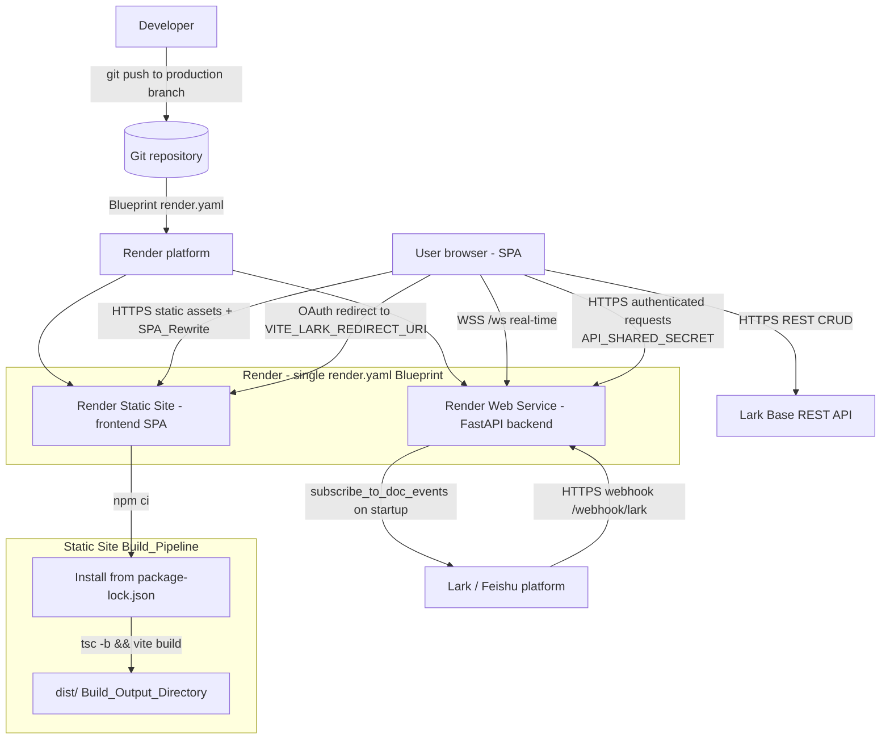

# Design Document: deployment-vercel

## Overview

This design describes how the HackatonMVP monorepo is deployed entirely on **Render**, with both
halves declared together in a single `render.yaml` Blueprint committed at the repository root:

- **Frontend (Frontend_SPA)** — the Vite + React 19 SPA at the repo root is built with
  `npm ci && tsc -b && vite build` and served as a **Render Static Site**. The Blueprint controls
  the build command, the publish directory (`dist`), the SPA rewrite that lets `react-router-dom`
  own client-side routing, and the build-time `VITE_*` environment variables. Render Static Sites
  serve the prebuilt assets in `dist`, support SPA rewrite rules, build-time environment variables,
  and custom domains.
- **Backend (Backend_Service)** — the FastAPI WebSocket relay in `backend/` is deployed as a
  **Render Web Service** built from the existing `backend/Dockerfile`. A Render Web Service supports
  the long-lived process the backend requires: the heartbeat loop, the flush scheduler, the Lark
  doc-event subscription, and in-memory WebSocket connection state, all in a single persistent
  process.

The two halves are joined by environment configuration. The SPA reaches the backend through
build-time `VITE_*` variables (notably `VITE_BACKEND_URL` and `VITE_WS_URL`, which point at the
stable `*.onrender.com` host of the Web Service). The backend trusts the SPA through `CORS_ORIGINS`
(which must list the Render Static Site production origin) and a shared secret (`API_SHARED_SECRET`
on the Web Service must equal `VITE_API_SHARED_SECRET` on the Static Site). Lark is reconfigured so
its webhook callback targets the Web Service host and its OAuth redirect targets the Static Site
origin.

The scope is **deployment configuration and process**, not application business logic. The only
source change contemplated is a small, deployment-driven adjustment to the Dockerfile start command
so the backend binds to the port Render assigns (see Architecture → Backend port binding).

### Why a static site for the frontend and a web service for the backend (key constraint)

The frontend is a static artifact best served by a static host, while the backend requires a
persistent process. Render supports both models, so the frontend runs as a Render Static Site and
the backend runs as a Render Web Service. A static host cannot run the backend, because the backend
relies on three things a static site cannot provide:

| Backend behavior | Source | Needs a persistent process? |
|---|---|---|
| WebSocket relay `/ws` | `app/routers/ws.py` | Yes — long-lived connection |
| Heartbeat loop (30s ping) | `app/main.py` `_heartbeat_loop` | Yes — always running |
| Flush scheduler | `app/main.py` lifespan + `FlushScheduler` | Yes — background task |
| Lark doc-event subscription | `app/main.py` lifespan `subscribe_to_doc_events` | Yes — runs on startup, persists |
| Connection registry / cache | `connection_manager`, in-memory cache | Yes — in-process state |

Render Web Services provide a continuously-running container, inbound WS, HTTPS/WSS, and stable
hostnames, so they satisfy these needs. The Render Static Site hosts only the prebuilt SPA assets.

## Architecture

### Deployment topology



### Request and routing model

- **Static asset request** (e.g. `/assets/index-abc.js`): the Render Static Site serves the file
  from `dist` directly. No rewrite.
- **Client-side route** (e.g. `/admin/projects/42`, or a hard refresh on that path): no matching
  static file exists, so the SPA_Rewrite serves `/index.html` with HTTP 200; `react-router-dom`
  then renders the correct view.
- **Real-time channel**: the SPA opens a WSS connection to `VITE_WS_URL`
  (`wss://<host>.onrender.com/ws`) served by the Render Web Service.
- **CRUD**: the SPA calls the Lark Base REST API directly (unchanged by this spec).
- **Webhook**: Lark posts events to `https://<host>.onrender.com/webhook/lark` on the Web Service.

### Backend port binding (Render Web Service)

Render assigns each Web Service a port via the `PORT` environment variable and routes external
HTTPS/WSS traffic to whatever port the container listens on. The current Dockerfile hardcodes
`--port 8000`:

```dockerfile
CMD ["uvicorn", "app.main:app", "--host", "0.0.0.0", "--port", "8000"]
```

To deploy reliably on Render the container must bind to the injected `PORT`. The design uses a
shell-form CMD so the variable is expanded at runtime, defaulting to `8000` for local Docker runs:

```dockerfile
CMD ["sh", "-c", "uvicorn app.main:app --host 0.0.0.0 --port ${PORT:-8000}"]
```

This is the single deployment-driven source change in scope. The host remains `0.0.0.0` so the
service is reachable from Render's router. (This finding applies only to the Web Service; the Static
Site has no server process and no port binding.)

### Configuration loading on the backend

`app/config.py` uses `pydantic-settings`, which reads values from the process environment first and
falls back to the `.env` file only when present. On the Render Web Service no `.env` file is shipped
(it is in `.dockerignore`), so every value comes from Render's environment variable / secret
settings. The two derived helpers matter for this spec:

- `cors_origins_list` splits `CORS_ORIGINS` on commas → fed to `CORSMiddleware(allow_origins=...)`.
- `configured_tables_list` splits `CONFIGURED_TABLES` on commas.

No code change is needed for config loading; only the values differ between local and production.

## Components and Interfaces

### Component 1: `render.yaml` (Render_Blueprint) — declares BOTH services

A single Blueprint committed at the repository root declares both the Frontend_Static_Site and the
Backend_Service. The static site declares the build command, the publish directory, the SPA rewrite,
and the six `VITE_*` build-time variables. The web service declares the Docker build from
`backend/Dockerfile`. Secrets are declared with `sync: false` so Render prompts for them in the
dashboard rather than reading them from the repo.

```yaml
services:
  # ---- Frontend: Render Static Site ----
  - type: web
    runtime: static
    name: hackatonmvp-frontend
    repo: https://github.com/<org>/<repo>
    branch: production
    buildCommand: npm ci && tsc -b && vite build
    staticPublishPath: dist
    autoDeploy: true
    # SPA rewrite: serve index.html (HTTP 200) for any path that is not a real
    # static file in dist, so react-router-dom can handle client-side routing.
    routes:
      - type: rewrite
        source: /*
        destination: /index.html
    envVars:
      - key: VITE_BACKEND_URL
        sync: false              # https://hackatonmvp-backend.onrender.com
      - key: VITE_WS_URL
        sync: false              # wss://hackatonmvp-backend.onrender.com/ws
      - key: VITE_LARK_APP_ID
        sync: false
      - key: VITE_LARK_APP_TOKEN
        sync: false
      - key: VITE_LARK_REDIRECT_URI
        sync: false              # on the Static Site origin
      - key: VITE_API_SHARED_SECRET
        sync: false              # must equal backend API_SHARED_SECRET

  # ---- Backend: Render Web Service (Docker) ----
  - type: web
    runtime: docker
    name: hackatonmvp-backend
    repo: https://github.com/<org>/<repo>
    branch: production
    dockerfilePath: ./backend/Dockerfile
    dockerContext: ./backend
    plan: starter
    healthCheckPath: /health
    autoDeploy: true
    numInstances: 1            # single instance: connection state + cache are per-process
    envVars:
      - key: CORS_ORIGINS
        sync: false              # set to the Render Static Site production origin
      - key: LARK_VERIFICATION_TOKEN
        sync: false
      - key: LARK_APP_ID
        sync: false
      - key: LARK_APP_SECRET
        sync: false
      - key: LARK_BASE_APP_TOKEN
        sync: false
      - key: LARK_BASE_URL
        value: https://open.larksuite.com/open-apis
      - key: CONFIGURED_TABLES
        sync: false
      - key: API_SHARED_SECRET
        sync: false              # must equal Static Site VITE_API_SHARED_SECRET
      - key: MAX_CONNECTIONS
        value: "50"
      - key: CACHE_TTL_SECONDS
        value: "300"
      - key: BATCH_FLUSH_INTERVAL_SECONDS
        value: "10"
```

Notes — Frontend_Static_Site:
- `buildCommand: npm ci && tsc -b && vite build` runs `npm ci` (installs from `package-lock.json`)
  then the exact production build (Requirements 1.1, 1.3, 9.2).
- `staticPublishPath: dist` publishes the Vite default output directory (Requirements 1.2, 9.2).
- The `routes` rewrite `{ type: rewrite, source: /*, destination: /index.html }` is the SPA_Rewrite:
  Render serves real files in `dist` before applying rewrites, so hashed assets are served directly
  and any unmatched route falls through to `/index.html` with HTTP 200 (Requirements 2.1, 2.2, 9.2).
- The static site build is scoped to the frontend at the repo root; the build command never invokes
  the Python `backend/` directory, and `backend/` contains no Node entrypoint, so it is excluded
  from the Build_Pipeline (Requirement 1.5).
- The six `VITE_*` variables are inlined into the bundle at build time (Requirements 3.1, 3.2).

Notes — Backend_Service (Render Web Service):
- `dockerContext: ./backend` ensures the build context matches the existing `Dockerfile`'s relative
  `COPY requirements.txt .` and `COPY app/ ./app/` paths (Requirements 4.2, 9.3).
- `healthCheckPath: /health` uses the existing health router; Render keeps the previous deploy live
  if a new one fails its health check.
- `numInstances: 1` preserves the single-process / in-memory invariant the WebSocket relay requires
  (Requirement 4.3). No horizontal scaling, because connection state and cache are per-process.
- Render gives the service a stable `https://hackatonmvp-backend.onrender.com` host exposing HTTPS
  and WSS (Requirements 4.4, 4.5).

### Component 2: Environment configuration (Environment_Config)

Two distinct stores within Render: the Render Static Site environment settings (frontend,
build-time) and the Render Web Service environment variable / secret settings (backend, runtime).
The shared-secret link is the only value that must be identical across both.

**Render Static Site — Production (build-time, inlined into the bundle):**

| Variable | Example production value | Purpose |
|---|---|---|
| `VITE_BACKEND_URL` | `https://hackatonmvp-backend.onrender.com` | REST/auth base to backend |
| `VITE_WS_URL` | `wss://hackatonmvp-backend.onrender.com/ws` | Real-time WebSocket endpoint |
| `VITE_LARK_APP_ID` | `cli_xxx` | Lark app id (public) |
| `VITE_LARK_APP_TOKEN` | `bascn_xxx` | Lark Base app token |
| `VITE_LARK_REDIRECT_URI` | `https://hackatonmvp-frontend.onrender.com/auth/callback` | OAuth redirect on the Static Site origin |
| `VITE_API_SHARED_SECRET` | `<shared secret>` | Auth header to backend; equals Web Service `API_SHARED_SECRET` |

**Render Web Service — backend runtime:**

| Variable | Source/value | Purpose |
|---|---|---|
| `LARK_VERIFICATION_TOKEN` | secret | Validates incoming Lark webhooks |
| `LARK_APP_ID` | secret | Lark API auth |
| `LARK_APP_SECRET` | secret | Lark API auth |
| `LARK_BASE_APP_TOKEN` | secret | Doc-event subscription target |
| `LARK_BASE_URL` | `https://open.larksuite.com/open-apis` | Lark API base |
| `CONFIGURED_TABLES` | config | Tables to cache |
| `API_SHARED_SECRET` | secret | Equals Static Site `VITE_API_SHARED_SECRET` |
| `CORS_ORIGINS` | config | Must include the Render Static Site production origin |
| `MAX_CONNECTIONS` | `50` | WS capacity |
| `CACHE_TTL_SECONDS` | `300` | Cache TTL (validator: 1–86400) |
| `BATCH_FLUSH_INTERVAL_SECONDS` | `10` | Flush interval (validator: 1–86400) |

Mapping / coupling rules:
- `VITE_BACKEND_URL` and `VITE_WS_URL` host portions both equal the Render Web Service host
  (Requirement 4.5).
- `CORS_ORIGINS` ⊇ { the origin portion of the Render Static Site production URL } (Requirement 6.1).
- `WebService.API_SHARED_SECRET == StaticSite.VITE_API_SHARED_SECRET` (Requirement 5.3).
- `VITE_LARK_REDIRECT_URI` is on the Render Static Site origin (Requirement 7.3) and must be
  registered in the Lark Developer Console redirect allowlist.

> Note: the current root `.env.example` lists `VITE_LARK_APP_SECRET`. The app secret belongs only on
> the backend (`LARK_APP_SECRET` on the Render Web Service) and must **not** be inlined into the
> client bundle. The example env file is updated to drop `VITE_LARK_APP_SECRET` and to list exactly
> the six `VITE_` variables in Requirement 3.1.

### Component 3: Example environment file (`.env.example`)

Updated at the repo root to enumerate every required `VITE_` variable name with placeholder
(non-secret) values, satisfying Requirement 9.4 and supporting Requirement 3.5 (operators know which
variables to set in the Render Static Site settings). `.env` remains gitignored (Requirement 9.5;
confirmed in `.gitignore`).

### Component 4: Lark Developer Console configuration (external)

Not a repo artifact, but a required deployment step documented here:
- **Event subscription / webhook URL** → `https://hackatonmvp-backend.onrender.com/webhook/lark`
  on the Render Web Service (Requirement 7.1). Lark sends a `url_verification` challenge;
  `webhook.py` already echoes the `challenge` field, so verification succeeds once the URL is
  reachable.
- **OAuth redirect URI** → the value of `VITE_LARK_REDIRECT_URI` on the Render Static Site origin
  (Requirement 7.3).
- The verification token entered in Lark must equal Web Service `LARK_VERIFICATION_TOKEN`
  (Requirement 7.4; enforced by `webhook.py` step 4).

### Interface contracts (backend endpoints, unchanged)

| Endpoint | Method | Source | Used by |
|---|---|---|---|
| `/ws` | WebSocket | `routers/ws.py` | SPA real-time channel (`VITE_WS_URL`) |
| `/webhook/lark` | POST | `routers/webhook.py` | Lark platform |
| `/health` | GET | `routers/health.py` | Render Web Service health check |
| `/tables/*` | GET | `routers/tables.py` | SPA (authenticated via shared secret) |

## Data Models

This feature introduces no application data models. The "data" is deployment configuration. The
relevant structured artifact is the single `render.yaml` Blueprint, which declares both a static
site service and a docker web service.

### Render_Blueprint (`render.yaml`) — Frontend_Static_Site service

| Field | Type | Constraint |
|---|---|---|
| `services[].type` | string | `web` |
| `services[].runtime` | string | `static` |
| `services[].buildCommand` | string | `npm ci && tsc -b && vite build` |
| `services[].staticPublishPath` | string | `dist` |
| `services[].routes[]` | array | At least one rewrite rule `{ type: rewrite, source: /*, destination: /index.html }` |
| `services[].envVars[]` | array | Declares the 6 `VITE_*` variables; all use `sync: false` |

### Render_Blueprint (`render.yaml`) — Backend_Service service

| Field | Type | Constraint |
|---|---|---|
| `services[].type` | string | `web` |
| `services[].runtime` | string | `docker` |
| `services[].dockerfilePath` | string | `./backend/Dockerfile` |
| `services[].dockerContext` | string | `./backend` |
| `services[].healthCheckPath` | string | `/health` |
| `services[].numInstances` | integer | `1` (single process for in-memory state) |
| `services[].envVars[]` | array | Declares the 11 backend variables; secrets use `sync: false` |

### Environment_Config (logical)

A pair of key→value maps with cross-store invariants:

```
StaticSite.production : { VITE_BACKEND_URL, VITE_WS_URL, VITE_LARK_APP_ID,
                          VITE_LARK_APP_TOKEN, VITE_LARK_REDIRECT_URI, VITE_API_SHARED_SECRET }
WebService.runtime    : { LARK_VERIFICATION_TOKEN, LARK_APP_ID, LARK_APP_SECRET,
                          LARK_BASE_APP_TOKEN, LARK_BASE_URL, CONFIGURED_TABLES,
                          API_SHARED_SECRET, CORS_ORIGINS, MAX_CONNECTIONS,
                          CACHE_TTL_SECONDS, BATCH_FLUSH_INTERVAL_SECONDS }

invariants:
  host(StaticSite.VITE_BACKEND_URL) == host(StaticSite.VITE_WS_URL) == WebService host
  origin(StaticSite.production URL) ∈ split(WebService.CORS_ORIGINS, ",")
  WebService.API_SHARED_SECRET == StaticSite.VITE_API_SHARED_SECRET
  origin(StaticSite.VITE_LARK_REDIRECT_URI) == origin(StaticSite.production URL)
```

## Correctness Properties

*A property is a characteristic or behavior that should hold true across all valid executions of a
system — essentially, a formal statement about what the system should do. Properties serve as the
bridge between human-readable specifications and machine-verifiable correctness guarantees.*

Most of this feature is declarative hosting configuration (a single `render.yaml` Blueprint, the
Render dashboard env stores, and the Lark console), which is validated with config-validation and
example tests rather than property-based tests. Two pieces of logic, however, generalize across a
wide input space and are expressed as universally-quantified properties below. The env-validation
prebuild guard applies to the Render Static Site build.

### Property 1: Missing required VITE_ variable fails the build with the variable name

*For any* subset of the six required `VITE_*` variables that is missing from the environment at
build time, the prebuild validation guard SHALL fail the Render Static Site build and SHALL report
the name of every missing variable.

**Validates: Requirements 3.5**

### Property 2: CORS reflects exactly the configured origins

*For any* request origin and *any* comma-separated `CORS_ORIGINS` configuration, the backend SHALL
emit cross-origin access headers for that origin if and only if the origin is a member of
`split(CORS_ORIGINS, ",")` — so the Render Static Site production origin (when listed) is accepted
and every unlisted origin is omitted.

**Validates: Requirements 6.1, 6.3**

## Error Handling

- **Frontend build failure (non-zero exit):** if `npm ci && tsc -b && vite build` exits non-zero,
  the Render Static Site marks the deploy failed and keeps the previous successful deploy as the
  active deployment (Requirements 1.4, 8.3). No partial `dist` is published.
- **Missing required `VITE_` variable:** a prebuild validation guard (Property 1) checks that all
  six `VITE_*` variables are present before `vite build` runs. If any is missing, the guard exits
  non-zero and prints the missing variable name(s), failing the Static Site deploy and preserving
  the previous deploy (Requirement 3.5).
- **SPA deep-link / refresh on an unknown path:** the SPA_Rewrite serves `/index.html` with HTTP 200
  so `react-router-dom` resolves the route client-side; a 404 is never returned for client routes
  (Requirements 2.1, 2.3).
- **Backend build/health failure:** if the Docker build fails or the new instance fails its
  `/health` check, the Render Web Service keeps the previous successful deploy active
  (Requirements 4.x, 8.3).
- **Port binding:** the Web Service binds `${PORT:-8000}`; if the Dockerfile bound a fixed port that
  differed from Render's injected `PORT`, the router could not reach the container. The shell-form
  CMD avoids this.
- **CORS rejection:** a request from an origin not in `CORS_ORIGINS` receives a response without
  cross-origin access headers, so the browser blocks it (Requirement 6.3).
- **Lark webhook verification failure:** `webhook.py` rejects requests whose token does not match
  `LARK_VERIFICATION_TOKEN` before processing (Requirement 7.4).

## Testing Strategy

This feature is primarily declarative deployment configuration. Most acceptance criteria are
verified with **config-validation tests** (assert structure of `render.yaml`), **example tests**,
and **integration/smoke checks** against the deployed services. Two items have meaningful input
variation and are covered by **property-based tests**.

### Config-validation tests (single `render.yaml`, both services)

Parse the repo-root `render.yaml` and assert:
- Exactly one `render.yaml` exists at the repository root and it declares **both** services
  (Requirement 9.1).
- A static-site service exists with `runtime: static`, `buildCommand: npm ci && tsc -b && vite build`,
  `staticPublishPath: dist`, and a rewrite route `{ type: rewrite, source: /*, destination: /index.html }`
  (Requirements 9.2, 1.1, 1.2, 2.1).
- The static-site service declares the six `VITE_*` variables (Requirement 3.1).
- A web-service exists with `runtime: docker`, `dockerfilePath: ./backend/Dockerfile`,
  `dockerContext: ./backend`, `healthCheckPath: /health`, and `numInstances: 1` (Requirements 9.3,
  4.2, 4.3).
- The web-service declares the 11 backend variables, with secrets using `sync: false`
  (Requirements 5.1, 5.2).
- **No `vercel.json` and no `.vercelignore` exist in the repository** (Render-only model).
- `.env` is excluded from version control and `.env.example` lists exactly the six `VITE_`
  variables, with no `VITE_LARK_APP_SECRET` (Requirements 9.4, 9.5).

### Example / smoke tests (post-deploy)

- Static asset request returns the asset directly (Requirement 2.2).
- Deep link / refresh on a client route returns `/index.html` with HTTP 200 (Requirements 2.1, 2.3).
- Backend `/health` returns healthy over HTTPS; `/ws` accepts a WSS connection from the Static Site
  origin (Requirements 4.4, 6.2).
- Lark webhook URL responds to the `url_verification` challenge (Requirement 7.1).

### Property-based tests

Two property-based tests, each tagged with its design property and run for a minimum of 100
iterations using the target language's property-testing library (do not hand-roll the framework):

- **Feature: deployment-vercel, Property 1** — generate random subsets of the six required `VITE_*`
  variables removed from the environment; assert the prebuild guard fails and names every missing
  variable.
- **Feature: deployment-vercel, Property 2** — generate random origins and random `CORS_ORIGINS`
  lists; assert cross-origin headers are emitted iff the origin is in `split(CORS_ORIGINS, ",")`.

Unit tests cover specific examples and edge cases (empty `CORS_ORIGINS`, a single missing variable,
duplicate origins); the property tests cover the general input space.
