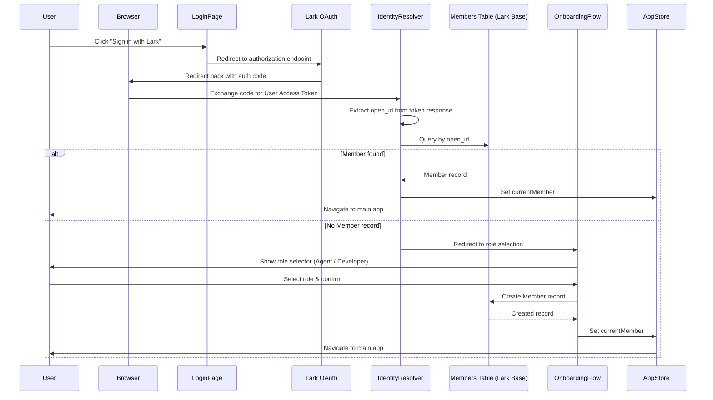
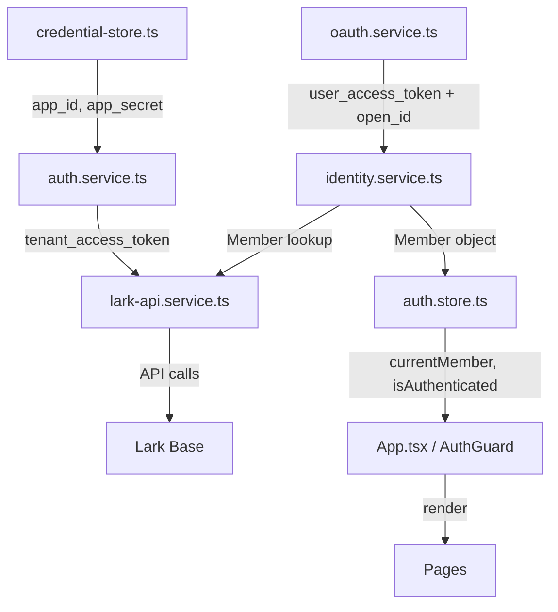

# Design Document: Lark Authentication

## Overview

This design describes the authentication and identity layer for the SP Madrid Gamified Tracker. The system replaces the current hardcoded `open_id` initialization with a real Lark OAuth login flow, tenant token management, user identity resolution, and new-user onboarding.

The authentication layer is split into two token domains:

1. **Tenant Access Token** — app-level credentials used to authorize all Lark Base API calls (existing, to be refactored for env-var sourcing and proper caching).
2. **User Access Token** — user-level token obtained via Lark OAuth, used solely to extract the user's `open_id` for identity resolution.

The design preserves the existing service-layer architecture. New modules slot into `src/services/` and `src/store/`, while existing code (`lark-api.service.ts`, `member.service.ts`, `app.store.ts`) is adapted to work with the auth layer rather than a hardcoded identity.



## Architecture

### Module Decomposition

| Module | Responsibility | Location |
|--------|---------------|----------|
| `auth.service.ts` | Tenant token acquisition, caching, injection, retry | `src/services/auth.service.ts` |
| `oauth.service.ts` | Lark OAuth redirect, code exchange, user token management | `src/services/oauth.service.ts` |
| `identity.service.ts` | Resolves open_id → Member, triggers onboarding if needed | `src/services/identity.service.ts` |
| `credential-store.ts` | Reads env vars with fallback to config.example.ts values | `src/services/credential-store.ts` |
| `auth.store.ts` | Zustand slice for auth state (user, tokens, loading, errors) | `src/store/auth.store.ts` |
| `LoginPage.tsx` | "Sign in with Lark" UI | `src/pages/LoginPage.tsx` |
| `OnboardingPage.tsx` | Role selection UI for new users | `src/pages/OnboardingPage.tsx` |
| `AuthGuard.tsx` | Route wrapper that redirects unauthenticated users | `src/components/auth/AuthGuard.tsx` |

### Data Flow



### Integration with Existing Code

- `lark-api.service.ts` already implements token fetching and retry. The refactor extracts token logic into `auth.service.ts` and makes `lark-api.service.ts` consume it as a dependency.
- `member.service.ts` already has `getCurrentMember(openId)`. The `identity.service.ts` module calls this function after extracting the open_id from OAuth.
- `app.store.ts` currently calls `initializeApp('ou_diana101')`. This is replaced by the auth store driving initialization after successful login.

## Components and Interfaces

### auth.service.ts

```typescript
interface TokenCache {
  token: string;
  expiresAt: number; // Unix ms
}

// Public API
function getTenantToken(): Promise<string>;
function invalidateTokenCache(): void;
function resetTokenCache(): void; // For testing

// Internal
function fetchTenantToken(): Promise<string>;
function isTokenValid(cache: TokenCache | null): boolean;
```

### oauth.service.ts

```typescript
interface OAuthConfig {
  appId: string;
  redirectUri: string;
  scope: string;
}

interface UserTokenResponse {
  accessToken: string;
  openId: string;
  expiresIn: number;
}

// Public API
function buildAuthorizationUrl(config: OAuthConfig): string;
function exchangeCodeForToken(code: string): Promise<UserTokenResponse>;
function getStoredSession(): StoredSession | null;
function storeSession(session: StoredSession): void;
function clearSession(): void;

interface StoredSession {
  userAccessToken: string;
  openId: string;
  expiresAt: number;
}
```

### identity.service.ts

```typescript
interface IdentityResult {
  status: 'resolved' | 'new_user' | 'error';
  member?: Member;
  openId?: string;
  displayName?: string;
  error?: string;
}

// Public API
function resolveIdentity(openId: string): Promise<IdentityResult>;
function createMemberRecord(
  openId: string,
  displayName: string,
  role: Role
): Promise<Member>;
```

### credential-store.ts

```typescript
interface Credentials {
  appId: string;
  appSecret: string;
  baseAppToken: string;
}

// Public API
function getCredentials(): Credentials;
function validateCredentials(creds: Credentials): boolean;
function warnIfPlaceholder(creds: Credentials): void;
```

### auth.store.ts (Zustand)

```typescript
interface AuthState {
  // State
  isAuthenticated: boolean;
  currentMember: Member | null;
  openId: string | null;
  isLoading: boolean;
  error: string | null;
  isOnboarding: boolean;

  // Actions
  login: () => void; // Initiates OAuth redirect
  handleCallback: (code: string) => Promise<void>;
  restoreSession: () => Promise<void>;
  logout: () => void;
  completeOnboarding: (role: Role) => Promise<void>;
  clearError: () => void;
}
```

### UI Components

#### LoginPage

- Renders the "Sign in with Lark" button
- On click, calls `auth.store.login()` which builds the OAuth URL and redirects

#### OnboardingPage

- Renders the Role Selector (Agent / Developer)
- Confirm button disabled until a role is selected
- On confirm, calls `auth.store.completeOnboarding(role)`
- Shows loading state during record creation
- Shows error state with retry if creation fails

#### AuthGuard

- Wraps protected routes
- Checks `auth.store.isAuthenticated`
- Redirects to `/login` if not authenticated
- Redirects to `/onboarding` if `isOnboarding` is true

## Data Models

### Session Storage Schema

| Key | Value | Purpose |
|-----|-------|---------|
| `sp-tracker-user-token` | JSON `{ accessToken, openId, expiresAt }` | Persists user session across page refreshes |
| `sp-tracker-selected-role` | `"agent"` or `"developer"` | Already exists — preserves role selection |

### Member Record (Lark Base — Members Table)

| Field | Type | Description |
|-------|------|-------------|
| `open_id` | Text | Lark user's app-scoped identifier |
| `display_name` | Text | User's display name from Lark profile |
| `roles` | Multi-select | `["agent"]` or `["developer"]` |
| `primary_role` | Single-select | `"agent"` or `"developer"` |
| `scrum_master_id` | Text | open_id of assigned scrum master (nullable) |

### Token Cache (In-Memory)

```typescript
interface TokenCache {
  token: string;       // The tenant_access_token string
  expiresAt: number;   // Unix timestamp in ms when token should be refreshed
}
```

### Environment Variables

| Variable | Description | Example |
|----------|-------------|---------|
| `VITE_LARK_APP_ID` | Lark app identifier | `cli_a91865699678de19` |
| `VITE_LARK_APP_SECRET` | Lark app secret | `(secret)` |
| `VITE_LARK_APP_TOKEN` | Lark Base app token | `PyPSbWKVpakTg5s0uEujZ24fpaf` |
| `VITE_LARK_REDIRECT_URI` | OAuth callback URL | `http://localhost:5173/auth/callback` |

## Correctness Properties

*A property is a characteristic or behavior that should hold true across all valid executions of a system — essentially, a formal statement about what the system should do. Properties serve as the bridge between human-readable specifications and machine-verifiable correctness guarantees.*

### Property 1: Token cache validity decision

*For any* token cache state (null, expired, or valid) and current timestamp, `getTenantToken()` SHALL fetch a new token if and only if the cache is null or its `expiresAt` is less than or equal to the current time. When the cache is valid (non-null with `expiresAt` > now), the cached token string SHALL be returned without issuing a network request.

**Validates: Requirements 1.1, 2.3, 2.4, 9.3, 9.4**

### Property 2: Expiration timestamp calculation

*For any* positive integer `expire` value returned by the Lark API and any current timestamp `now`, the stored `expiresAt` in the Token_Cache SHALL equal `now + (expire - 60) * 1000`. This ensures the token is refreshed 60 seconds before its actual expiry at the platform.

**Validates: Requirements 1.2, 2.1, 2.2**

### Property 3: Error response propagation

*For any* non-zero error code and non-empty error message returned by the Lark token endpoint, the error thrown by `fetchTenantToken()` SHALL contain both the error code and the error message string.

**Validates: Requirements 1.3**

### Property 4: OAuth authorization URL construction

*For any* valid `appId`, `redirectUri`, and `scope` strings, the URL returned by `buildAuthorizationUrl()` SHALL contain the `appId` as the `app_id` query parameter, the `redirectUri` as the `redirect_uri` query parameter (URL-encoded), and the `scope` as the `scope` query parameter.

**Validates: Requirements 3.2**

### Property 5: Session storage round-trip

*For any* valid session object (containing a non-empty `userAccessToken`, non-empty `openId`, and positive `expiresAt` timestamp), calling `storeSession(session)` followed by `getStoredSession()` SHALL return an object with identical `userAccessToken`, `openId`, and `expiresAt` values.

**Validates: Requirements 3.6, 3.9**

### Property 6: Member record mapping

*For any* valid Lark record containing `open_id`, `display_name`, `roles`, `primary_role`, and `scrum_master_id` fields, the `mapRecordToMember()` function SHALL produce a Member object where `openId` equals the extracted `open_id` text, `displayName` equals the extracted `display_name` text, `primaryRole` is one of `"agent"` or `"developer"`, and `roles` is a non-empty array containing only valid role values.

**Validates: Requirements 4.1, 4.2**

### Property 7: Onboarding record creation structure

*For any* valid combination of `openId` (non-empty string), `displayName` (non-empty string), and `role` (either `"agent"` or `"developer"`), the record payload sent to `createRecord()` during onboarding SHALL contain fields: `open_id` set to the provided openId, `display_name` set to the provided displayName, `primary_role` set to the selected role, `roles` as an array containing the selected role, and `scrum_master_id` set to null.

**Validates: Requirements 5.4**

### Property 8: Credential resolution with fallback

*For any* configuration of environment variables, `getCredentials()` SHALL return the env var value when the variable is set to a non-empty string, and SHALL return the corresponding fallback value from `config.example.ts` when the variable is unset or empty. The returned credentials object SHALL always have non-empty `appId`, `appSecret`, and `baseAppToken` fields.

**Validates: Requirements 6.1, 6.2, 6.3**

### Property 9: Placeholder credential detection

*For any* credential string, `validateCredentials()` SHALL return false (and `warnIfPlaceholder()` SHALL log a console warning) if and only if the string matches the placeholder pattern from `.env.example` (e.g., `"your_app_id_here"`). For any credential string that does NOT match the placeholder pattern, no warning SHALL be logged.

**Validates: Requirements 6.6**

### Property 10: Retry with cache invalidation

*For any* sequence of transient failures (network errors, HTTP 5xx, or timeouts), the `withRetry()` wrapper SHALL make exactly 3 total attempts. Before each retry attempt (attempts 2 and 3), the Token_Cache SHALL be invalidated (set to null). After all 3 attempts fail, the error thrown SHALL be the error from the final (3rd) attempt.

**Validates: Requirements 8.1, 8.4, 8.5**

### Property 11: Non-retryable error short-circuit

*For any* error whose message starts with "Token fetch" or contains "record not found", `withRetry()` SHALL throw the error immediately after the first attempt without consuming additional retry attempts.

**Validates: Requirements 8.6**

### Property 12: Bearer token header format

*For any* non-empty token string `t`, all outgoing Lark API requests SHALL include an `Authorization` header with the exact value `"Bearer " + t` (one space between "Bearer" and the token, no trailing whitespace).

**Validates: Requirements 9.1**

## Error Handling

### Token Acquisition Errors

| Error Type | Handling |
|-----------|----------|
| Network failure during token fetch | Propagated immediately to caller; outer retry logic handles retry |
| Non-zero response code from Lark | Thrown as non-retryable error with code and message |
| Request timeout (10s) | AbortError caught and converted to readable timeout message |

### OAuth Errors

| Error Type | Handling |
|-----------|----------|
| Code exchange failure | Redirect to LoginPage with error message |
| Empty or invalid open_id | Redirect to LoginPage with "identity could not be determined" message |
| Invalid/expired session token | Clear session storage, redirect to LoginPage |

### Identity Resolution Errors

| Error Type | Handling |
|-----------|----------|
| No Member record found | Route to OnboardingPage (not an error) |
| Members query network failure | Retry up to 3 times, then show error with retry button |
| Invalid open_id input | Redirect to login with error |

### Onboarding Errors

| Error Type | Handling |
|-----------|----------|
| Member record creation fails | Show error message, re-enable confirm button, preserve role selection |
| Network timeout during creation | Same as above — user can retry without re-selecting |

### API Request Errors (General)

| Error Type | Retryable | Handling |
|-----------|-----------|----------|
| Network failure | Yes | Retry up to 3 attempts, invalidate token cache between retries |
| HTTP 5xx | Yes | Same as network failure |
| Request timeout | Yes | Same as network failure |
| HTTP 401/403 | Yes (with fresh token) | Invalidate cache, retry with new token |
| Token fetch error | No | Throw immediately |
| Record not found | No | Throw immediately |

## Testing Strategy

### Property-Based Tests (fast-check, minimum 100 iterations)

The following properties are tested using `fast-check` with Vitest:

| Property | Module Under Test | Key Generators |
|----------|------------------|----------------|
| 1: Token cache validity | `auth.service.ts` | Arbitrary cache states (null, expired timestamps, valid timestamps) |
| 2: Expiration calculation | `auth.service.ts` | Positive integers for expire, arbitrary timestamps for now |
| 3: Error response propagation | `auth.service.ts` | Non-zero integers, arbitrary strings |
| 4: OAuth URL construction | `oauth.service.ts` | Arbitrary non-empty strings (appId, redirect, scope) |
| 5: Session round-trip | `oauth.service.ts` | Arbitrary session objects |
| 6: Member record mapping | `identity.service.ts` / `member.service.ts` | Arbitrary Lark record structures |
| 7: Onboarding record structure | `identity.service.ts` | Arbitrary (openId, displayName, role) tuples |
| 8: Credential fallback | `credential-store.ts` | Arbitrary env var states (set, empty, unset) |
| 9: Placeholder detection | `credential-store.ts` | Arbitrary strings including placeholder patterns |
| 10: Retry with invalidation | `auth.service.ts` | Sequences of transient error types |
| 11: Non-retryable short-circuit | `auth.service.ts` | Error messages matching non-retryable patterns |
| 12: Bearer header format | `auth.service.ts` | Arbitrary non-empty token strings |

Each property test file:
- Lives in `src/services/__tests__/` alongside the module
- Uses `fc.assert(fc.property(...))` with `{ numRuns: 100 }` minimum
- Is tagged with a comment: `// Feature: lark-authentication, Property N: <title>`

### Example-Based Unit Tests (Vitest)

| Test Area | Cases |
|-----------|-------|
| Token timeout | Fake timers: verify abort after 10s |
| Network error passthrough | Mock fetch rejection, verify propagation |
| Login page rendering | Unauthenticated state renders button |
| Logout | Session storage cleared, redirect to /login |
| Role selector | Two options rendered, confirm disabled until selection |
| Onboarding success | Navigation within 2s of success |
| Onboarding failure | Error shown, button re-enabled, role preserved |
| Dev vs prod URL | DEV flag toggles /lark-api vs direct URL |
| Content-Type header | All requests include application/json |
| No-delay retries | Fake timers confirm immediate retry |

### Integration Tests

| Test Area | Approach |
|-----------|----------|
| Full OAuth flow | End-to-end with mocked Lark endpoints |
| Session restoration | Mount app with pre-populated sessionStorage |
| Proxy configuration | Vite config assertions (vite.config.ts structure) |

### Test File Organization

```
src/services/__tests__/
├── auth.service.test.ts          # Unit + property tests for token logic
├── auth.service.property.test.ts # Property-only tests (Properties 1, 2, 3, 10, 11, 12)
├── oauth.service.test.ts         # Unit + property tests for OAuth (Properties 4, 5)
├── identity.service.test.ts      # Unit + property tests (Properties 6, 7)
├── credential-store.test.ts      # Unit + property tests (Properties 8, 9)
```

