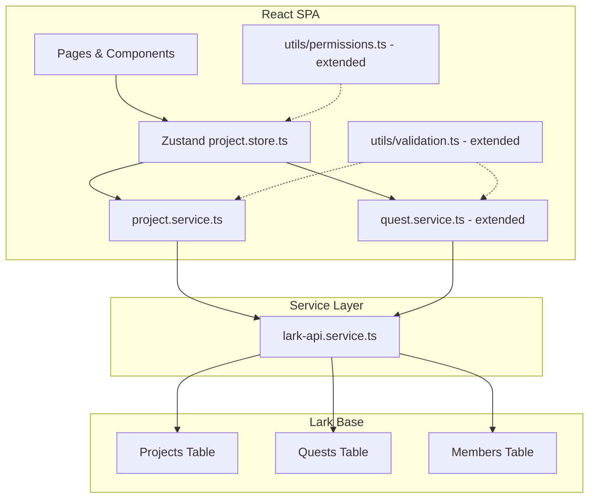

# Design Document: Project Task Management

## Overview

This feature adds project-scoped task management to the SP Madrid Gamified Tracker. It introduces a **Projects** table in Lark Base and builds service/store/UI layers that enforce:

- Developers propose tasks scoped to their assigned project
- Scrum Masters create/manage tasks in projects they are "assigned" to (derived from task-level SM assignments)
- Admins rename projects and assign Scrum Masters per task

The design follows the existing frontend-only architecture: React SPA → `lark-api.service.ts` → Lark Base REST API. No new backend endpoints are required for CRUD — the FastAPI server remains a WebSocket relay only.

## Architecture



### Key Architectural Decisions

1. **Derived SM project scope** — No separate "SM-Project" junction table. A Scrum Master's assigned projects are computed by querying the Quests table for tasks where `scrum_master_id` matches the SM's member ID. This avoids data duplication and keeps Lark Base as the single source of truth.

2. **New `project.service.ts`** — Encapsulates all project CRUD (list, rename) and the SM-project derivation query. Follows the existing pattern of named function exports.

3. **Extended `quest.service.ts`** — Task creation functions (`proposeTask`, `delegateTask`) already accept `projectIds`. The SM task creation path adds authorization checks against the derived project set.

4. **New `project.store.ts`** — Zustand store for project state: project list, current project selection, SM project derivation cache. Follows existing `useAppStore` patterns.

5. **Optimistic updates with rollback** — Project renames and SM assignments update local state immediately, then persist to Lark Base. On sync failure, state is reverted and an error is shown (matching the existing `completeQuest` rollback pattern).

## Components and Interfaces

### New Service: `project.service.ts`

```typescript
// ─── Public API ─────────────────────────────────────────────────────────────

/** Lists all projects from the Projects table. */
export async function listProjects(): Promise<Project[]>;

/** Returns projects where the developer is a member (projectId on Members record). */
export async function getProjectsForDeveloper(memberId: string): Promise<Project[]>;

/** Derives the set of projects assigned to a Scrum Master from task-level assignments. */
export async function getAssignedProjectsForScrumMaster(scrumMasterId: string): Promise<Project[]>;

/** Renames a project. Validates name, checks uniqueness, persists to Lark Base. */
export async function renameProject(
  projectId: string,
  newName: string,
  existingProjects: Project[]
): Promise<Project>;

/** Assigns a Scrum Master to a task. Validates SM role, persists to Lark Base. */
export async function assignScrumMasterToTask(
  taskId: string,
  scrumMasterId: string,
  callerRole: Role
): Promise<void>;

/** Lists all members with the Scrum Master role. */
export async function listScrumMasters(): Promise<Member[]>;
```

### New Store: `project.store.ts`

```typescript
export interface ProjectState {
  projects: Project[];
  developerProjects: Project[];       // filtered for current developer
  smAssignedProjects: Project[];      // derived for current SM
  scrumMasters: Member[];             // all SM-role users
  projectsLoading: boolean;

  // Actions
  fetchProjects: () => Promise<void>;
  fetchDeveloperProjects: (memberId: string) => Promise<void>;
  fetchSmAssignedProjects: (scrumMasterId: string) => Promise<void>;
  renameProject: (projectId: string, newName: string) => Promise<void>;
  assignScrumMasterToTask: (taskId: string, scrumMasterId: string) => Promise<void>;
  fetchScrumMasters: () => Promise<void>;
}
```

### Extended Validation Functions (`utils/validation.ts`)

```typescript
/** Validates a project name for renaming: 1–100 chars after trim, not whitespace-only. */
export function validateProjectName(name: string): ValidationResult;

/** Validates project name uniqueness (case-insensitive) against existing names. */
export function validateProjectNameUniqueness(
  name: string,
  existingNames: string[],
  currentProjectId?: string
): ValidationResult;

/** Validates SM task creation: title 1–200 chars, assignee required, project required. */
export function validateSmTaskCreation(
  title: string,
  assigneeId: string,
  projectId: string
): ValidationResult;
```

### Extended Permission Functions (`utils/permissions.ts`)

```typescript
/** Returns true if member has admin role. (already exists as isAdmin) */
export function canRenameProject(member: Member): boolean;

/** Returns true if member has admin role — gates SM assignment. */
export function canAssignScrumMaster(member: Member): boolean;

/** Returns true if the SM is assigned to the given project (derived from tasks). */
export function isScrumMasterAssignedToProject(
  scrumMasterId: string,
  projectTaskMap: Map<string, string[]>  // projectId → [scrumMasterIds]
): boolean;
```

### UI Components

| Component | Location | Purpose |
|-----------|----------|---------|
| `ProjectSelector` | `components/project/ProjectSelector.tsx` | Dropdown for project selection during task proposal/creation |
| `ProjectRenameForm` | `components/project/ProjectRenameForm.tsx` | Inline rename form for admins |
| `ScrumMasterAssigner` | `components/project/ScrumMasterAssigner.tsx` | SM selection control on task details |
| `ProjectList` | `components/project/ProjectList.tsx` | Admin view of all projects |

## Data Models

### Projects Table (New — Lark Base)

| Field | Type | Description |
|-------|------|-------------|
| `name` | Text | Project display name (1–100 chars) |
| `description` | Text | Optional project description |

The `record_id` serves as the project identifier. No additional fields are needed since membership is stored on the Members table (`project_id` field) and SM assignment is derived from task data.

### Extended Quests Table Fields

| Field | Type | Description |
|-------|------|-------------|
| `project_ids` | Text | Comma-separated project IDs (existing field, already in use) |
| `scrum_master_id` | Text | Member record ID of assigned Scrum Master (new field) |

### Config Extension (`config.ts`)

```typescript
export const TABLE_IDS = {
  // ... existing tables
  projects: 'tblProjects',  // NEW
} as const;
```

### TypeScript Interface (already exists in `types/index.ts`)

```typescript
export interface Project {
  projectId: string;
  name: string;
  description: string;
}
```

### Domain Logic: SM Project Derivation

The set of "assigned projects" for a Scrum Master is computed as:

```
AssignedProjects(SM) = { p.projectId | task ∈ Quests, task.scrum_master_id = SM.memberId, p ∈ task.project_ids }
```

This is a pure derivation from the Quests table — no junction table needed. When the last task linking a SM to a project is deleted or reassigned, that project naturally disappears from the derived set.

## Correctness Properties

*A property is a characteristic or behavior that should hold true across all valid executions of a system — essentially, a formal statement about what the system should do. Properties serve as the bridge between human-readable specifications and machine-verifiable correctness guarantees.*

### Property 1: Developer project list contains only member projects, sorted alphabetically, capped at 50

*For any* developer with a set of project memberships and *for any* set of projects in the system, the `getProjectsForDeveloper` function SHALL return only projects whose ID matches the developer's `projectId`, sorted alphabetically by name, with at most 50 entries.

**Validates: Requirements 1.1, 1.5**

### Property 2: Task proposal associates correct project and sets pending status

*For any* valid task proposal submission with a selected project ID, the resulting task record SHALL have `project_ids` containing the selected project and `status` equal to "pending".

**Validates: Requirements 1.3**

### Property 3: Project rename trims whitespace and updates name

*For any* valid project name string (1–100 non-whitespace chars after trim), the `renameProject` function SHALL return a project whose name equals the trimmed input, with no leading or trailing whitespace.

**Validates: Requirements 2.1**

### Property 4: Project name validation rejects invalid inputs

*For any* string that is empty after trimming (whitespace-only) OR exceeds 100 characters after trimming, the `validateProjectName` function SHALL return `{ valid: false }` with an appropriate error message.

**Validates: Requirements 2.4, 2.5**

### Property 5: Duplicate project names rejected case-insensitively

*For any* proposed project name and *for any* existing project with a name that matches case-insensitively (after trimming both), the `validateProjectNameUniqueness` function SHALL return `{ valid: false }`.

**Validates: Requirements 2.7**

### Property 6: Project rename preserves all other project data

*For any* project with existing tasks and members, after a successful rename, the project's tasks, members, and description SHALL remain unchanged — only the `name` field differs.

**Validates: Requirements 2.3**

### Property 7: Non-admin users are denied admin-only operations

*For any* member whose roles do NOT include "admin", the functions `canRenameProject` and `canAssignScrumMaster` SHALL return `false`.

**Validates: Requirements 2.2, 4.3**

### Property 8: SM task creation in assigned project produces correct output

*For any* valid task creation request by a Scrum Master in a project they are assigned to, the resulting task SHALL have `status` = "active", `assignment_type` = "assigned", and the correct `project_ids`.

**Validates: Requirements 3.1**

### Property 9: SM denied task creation in unassigned project

*For any* Scrum Master and *for any* project where no task in that project has `scrum_master_id` matching the SM, the task creation function SHALL deny the operation with an authorization error.

**Validates: Requirements 3.2**

### Property 10: SM assigned projects derived correctly from task data

*For any* set of tasks in the system, the derived assigned projects for a Scrum Master SHALL equal exactly the set of unique project IDs from tasks where `scrum_master_id` matches that SM's member identifier.

**Validates: Requirements 3.3, 3.7, 4.4**

### Property 11: Last task removal revokes SM project access

*For any* Scrum Master with exactly one task linking them to a project, if that task's `scrum_master_id` is changed to a different SM or the task is deleted, the project SHALL no longer appear in the original SM's assigned project set.

**Validates: Requirements 3.4**

### Property 12: SM task creation validation enforces required fields

*For any* task creation input where the title is empty, exceeds 200 characters, or is whitespace-only, OR where the assignee ID is missing, OR where the project ID is missing, the validation SHALL reject the input.

**Validates: Requirements 3.8**

### Property 13: SM assignment enforces role constraint and single-assignment

*For any* member selected for Scrum Master assignment on a task, the assignment SHALL succeed only if the member holds the Scrum Master role, and the resulting task SHALL have exactly one `scrum_master_id` value equal to that member's record identifier (replacing any previous value).

**Validates: Requirements 4.2, 4.7**

## Error Handling

| Scenario | Handling Strategy |
|----------|-------------------|
| Lark Base sync failure (rename) | Optimistic rollback: revert local project name to previous value, show error banner |
| Lark Base sync failure (task creation) | Do NOT add task to local list, show error message |
| Lark Base sync failure (SM assignment) | Revert SM assignment in UI to previous value, show error banner |
| Validation failure (project name) | Block submission, show inline validation error below input |
| Validation failure (task fields) | Block submission, show inline validation errors |
| Authorization failure (non-admin) | Deny action immediately, show "insufficient permissions" error |
| No projects available (developer) | Disable submit button, show "no projects available" message |
| No scrum masters available | Disable SM selector, show "no Scrum Masters available" message |
| Network timeout (10s) | Handled by `lark-api.service.ts` retry logic (3 attempts) |

All errors follow existing patterns:
- Service functions throw on failure
- Store actions catch and handle (rollback + UI state)
- `withBackendRetry` handles transient network/server errors automatically
- Non-retryable errors (validation, auth) throw immediately

## Testing Strategy

### Property-Based Tests (fast-check, minimum 100 iterations)

Property-based testing is appropriate for this feature because it contains pure validation logic, filtering/sorting logic, and derivation computations that operate over a large input space (arbitrary strings, member lists, task sets).

**Library**: `fast-check` (already in project dependencies)
**Config**: `{ numRuns: 100 }` minimum per property test
**Location**: `src/services/__tests__/project.service.test.ts` and `src/utils/__tests__/validation.test.ts`

Each property test references its design property:
```typescript
// Feature: project-task-management, Property 1: Developer project list filtering
```

Properties to implement as PBT:
- Property 1: Developer project list filtering and sorting
- Property 2: Task proposal output shape
- Property 3: Project rename trimming
- Property 4: Project name validation (empty/whitespace/length)
- Property 5: Duplicate name detection (case-insensitive)
- Property 7: Non-admin denial
- Property 10: SM project derivation from tasks
- Property 11: Last task removal revokes access
- Property 12: SM task creation validation
- Property 13: SM assignment role enforcement

### Unit Tests (Vitest example-based)

- Developer with no project → empty list, disabled state (Req 1.2)
- Lark sync failure → error message, task not added (Req 1.7, 3.6)
- Lark sync failure for rename → rollback (Req 2.8)
- SM assignment sync failure → rollback (Req 4.6)
- No SM-role users → disabled control (Req 4.8)
- Admin opens task details → SM list pre-selected (Req 4.1)
- Rename preserves tasks/members (Req 2.3, integration-level mock)

### Integration Tests

- Full task proposal flow: developer → proposeTask → Lark Base (mock)
- Full rename flow: admin → renameProject → updateRecord called with correct fields
- SM assignment flow: admin → assignScrumMasterToTask → updateRecord
- SM task creation authorization flow end-to-end (with mocked Lark)

### Test File Organization

```
src/
├── services/__tests__/
│   ├── project.service.test.ts       # PBT + unit tests for project service
│   └── quest.service.test.ts         # Extended with SM task creation tests
├── utils/__tests__/
│   ├── validation.test.ts            # Extended with project name validation PBT
│   └── permissions.test.ts           # Extended with project permission checks
└── store/__tests__/
    └── project.store.test.ts         # Store action tests with mocked services
```
