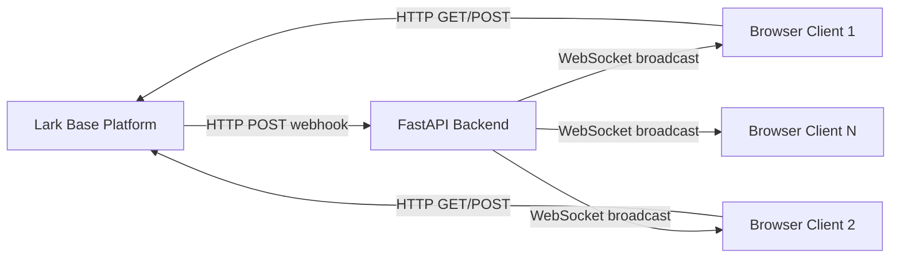
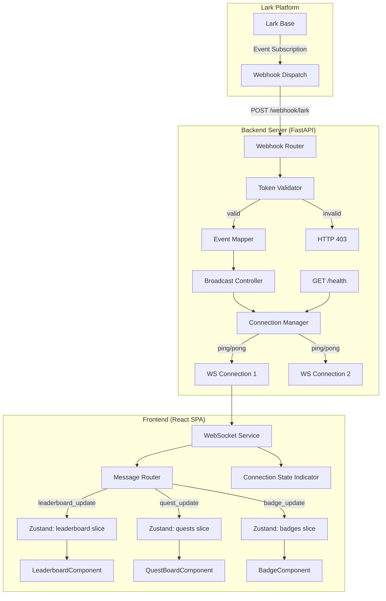
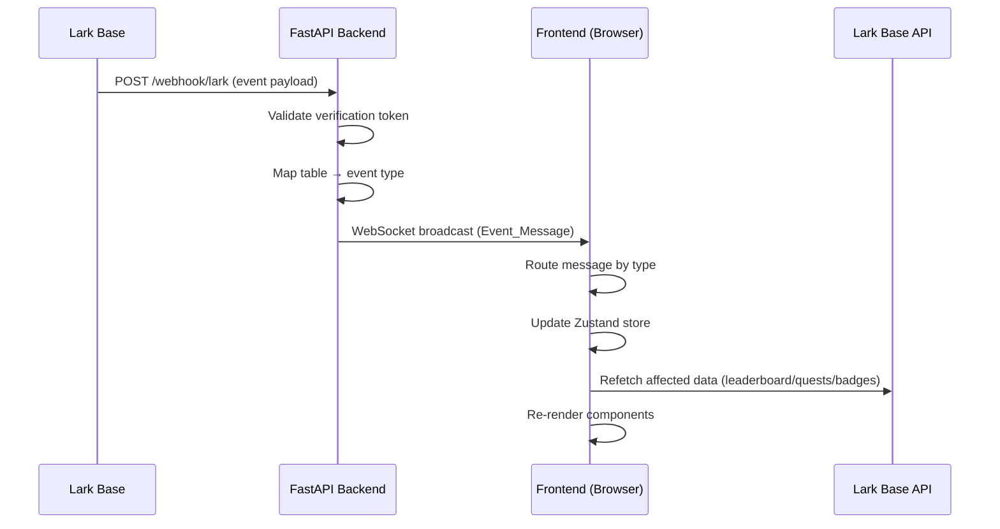
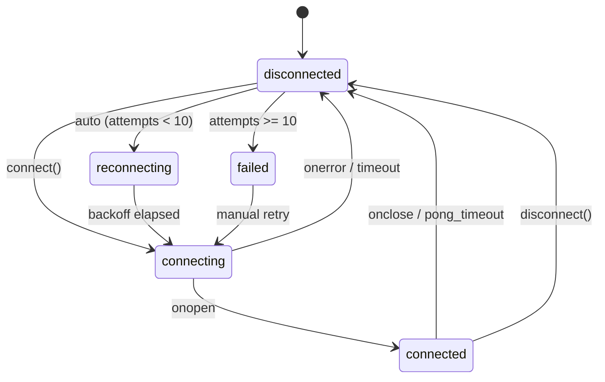

# Design Document: Real-Time Updates

## Overview

This design introduces a real-time data push architecture to the SP Madrid Gamified Tracker. Currently the app is a frontend-only React SPA that polls Lark Base on user actions. This feature adds:

1. **A FastAPI Python backend server** that receives Lark Base event webhooks and maintains WebSocket connections to browser clients.
2. **A frontend WebSocket service** that manages connection lifecycle, heartbeat, and reconnection with exponential backoff.
3. **An event routing layer** that dispatches typed messages to the appropriate Zustand store slices.

The system follows a fan-out broadcast pattern: one webhook event from Lark → one backend broadcast → N connected clients receive the update simultaneously.

### Key Design Decisions

| Decision | Rationale |
|----------|-----------|
| FastAPI + uvicorn | Async-first Python framework with native WebSocket support; lightweight for a relay server |
| In-memory connection set | Team size is <50 users; no need for Redis pub/sub or message broker |
| Client-side refetch on event | Backend sends lightweight notification events; frontend refetches full data from Lark Base API. This avoids duplicating business logic in the backend |
| Exponential backoff (1s–30s, 10 attempts) | Balances reconnection speed with server load protection |
| Heartbeat every 30s | Keeps connections alive through proxies/NATs; detects dead clients |

### System Context Diagram



## Architecture

### High-Level Architecture



### Data Flow Sequence



### Deployment Topology

The backend server runs as a standalone process (e.g., on a VM, container, or PaaS). The frontend connects to it via a WebSocket URL configured through environment variables.

```
Frontend (.env):  VITE_WS_URL=wss://realtime.sp-madrid.example.com/ws

Backend (.env):   LARK_VERIFICATION_TOKEN=<token>
                  CORS_ORIGINS=https://sp-madrid.example.com
                  MAX_CONNECTIONS=50
```

## Components and Interfaces

### Backend Components

#### 1. Webhook Router (`POST /webhook/lark`)

Receives Lark Base event webhooks and dispatches them.

```python
# app/routers/webhook.py
from fastapi import APIRouter, Request, HTTPException
from app.models import LarkWebhookPayload, EventMessage
from app.services.connection_manager import ConnectionManager
from app.services.event_mapper import map_webhook_to_event

router = APIRouter()

@router.post("/webhook/lark")
async def receive_webhook(request: Request) -> dict:
    """
    Receives and validates Lark Base webhook events.
    Returns challenge for URL verification, broadcasts events for data changes.
    """
    ...
```

**Validation logic:**
1. Check Content-Length ≤ 1 MB → HTTP 413 if exceeded
2. Parse JSON body
3. If `type == "url_verification"` → return `{"challenge": body.challenge}`
4. Compare `body.token` against configured `LARK_VERIFICATION_TOKEN` → HTTP 403 if mismatch
5. Extract table name from event payload
6. Map table to event type (or discard if unrecognized table)
7. Broadcast to connected clients

#### 2. Connection Manager

Manages the set of active WebSocket connections.

```python
# app/services/connection_manager.py
from fastapi import WebSocket
import asyncio
import time

class ConnectionManager:
    def __init__(self, max_connections: int = 50):
        self.active_connections: dict[str, WebSocket] = {}  # connection_id → WebSocket
        self.max_connections = max_connections
        self._connection_counter = 0

    async def connect(self, websocket: WebSocket) -> str:
        """Accept WebSocket, assign connection_id, send connection_ack."""
        ...

    def disconnect(self, connection_id: str) -> None:
        """Remove a connection from the active set."""
        ...

    async def broadcast(self, message: EventMessage) -> None:
        """Send message to all connected clients. Remove failed connections."""
        ...

    async def send_personal(self, connection_id: str, message: EventMessage) -> None:
        """Send message to a specific connection."""
        ...

    def get_connection_count(self) -> int:
        """Return current number of active connections."""
        ...

    async def ping_all(self) -> None:
        """Send ping frame to all connections, disconnect unresponsive ones after 10s."""
        ...
```

#### 3. Event Mapper

Maps Lark webhook table names to typed event messages.

```python
# app/services/event_mapper.py
from app.models import EventMessage, EventType
from datetime import datetime, timezone

TABLE_EVENT_MAP: dict[str, EventType] = {
    "quest_completions": "leaderboard_update",
    "quests": "quest_update",
    "badge_earned": "badge_update",
}

def map_webhook_to_event(table_name: str, event_data: dict) -> EventMessage | None:
    """
    Maps a Lark webhook event to a typed EventMessage.
    Returns None if the table is not in the recognized set.
    """
    ...
```

#### 4. Health Endpoint (`GET /health`)

```python
# app/routers/health.py
@router.get("/health")
async def health_check() -> dict:
    """Returns connection count and server uptime."""
    return {
        "status": "ok",
        "connections": manager.get_connection_count(),
        "uptime_seconds": time.time() - start_time,
    }
```

#### 5. WebSocket Endpoint (`GET /ws`)

```python
# app/routers/ws.py
@router.websocket("/ws")
async def websocket_endpoint(websocket: WebSocket):
    """
    Accepts WebSocket connections, handles ping/pong lifecycle.
    Removes connection on disconnect or pong timeout.
    """
    ...
```

### Frontend Components

#### 1. WebSocket Service (`src/services/websocket.service.ts`)

Singleton service managing the WebSocket lifecycle.

```typescript
// src/services/websocket.service.ts

export type ConnectionState = 'connecting' | 'connected' | 'disconnected' | 'reconnecting' | 'failed';

export interface WebSocketServiceOptions {
  url: string;
  heartbeatIntervalMs?: number;   // default: 30_000
  heartbeatTimeoutMs?: number;    // default: 5_000
  maxReconnectAttempts?: number;  // default: 10
  initialReconnectDelayMs?: number; // default: 1_000
  maxReconnectDelayMs?: number;   // default: 30_000
}

export type MessageHandler = (message: EventMessage) => void;

class WebSocketService {
  private ws: WebSocket | null = null;
  private state: ConnectionState = 'disconnected';
  private reconnectAttempts = 0;
  private heartbeatTimer: ReturnType<typeof setInterval> | null = null;
  private pongTimer: ReturnType<typeof setTimeout> | null = null;
  private reconnectTimer: ReturnType<typeof setTimeout> | null = null;
  private messageHandlers: Set<MessageHandler> = new Set();
  private stateChangeHandlers: Set<(state: ConnectionState) => void> = new Set();

  connect(options: WebSocketServiceOptions): void { ... }
  disconnect(): void { ... }
  onMessage(handler: MessageHandler): () => void { ... }
  onStateChange(handler: (state: ConnectionState) => void): () => void { ... }
  getState(): ConnectionState { ... }

  private startHeartbeat(): void { ... }
  private stopHeartbeat(): void { ... }
  private handlePongTimeout(): void { ... }
  private scheduleReconnect(): void { ... }
  private getReconnectDelay(): number { ... }
}

export const websocketService = new WebSocketService();
```

**Reconnection Algorithm (Exponential Backoff):**

```
delay = min(initialDelay * 2^attempt, maxDelay)
       = min(1000 * 2^attempt, 30000)

Attempt 0: 1s
Attempt 1: 2s
Attempt 2: 4s
Attempt 3: 8s
Attempt 4: 16s
Attempt 5+: 30s (capped)
```

After 10 failed attempts, state transitions to `"failed"` and automatic reconnection stops.

#### 2. Message Router (`src/services/message-router.ts`)

Routes incoming WebSocket messages to appropriate store actions.

```typescript
// src/services/message-router.ts
import type { EventMessage } from '../types/realtime';
import { useAppStore } from '../store/app.store';

export function routeMessage(message: EventMessage): void {
  switch (message.type) {
    case 'leaderboard_update':
      handleLeaderboardUpdate(message.payload);
      break;
    case 'quest_update':
      handleQuestUpdate(message.payload);
      break;
    case 'badge_update':
      handleBadgeUpdate(message.payload);
      break;
    case 'connection_ack':
      handleConnectionAck(message.payload);
      break;
  }
}

function handleLeaderboardUpdate(payload: LeaderboardUpdatePayload): void {
  // Trigger leaderboard refetch from Lark Base API
  useAppStore.getState().fetchLeaderboard();
}

function handleQuestUpdate(payload: QuestUpdatePayload): void {
  // Trigger quest refetch from Lark Base API
  useAppStore.getState().fetchQuests();
}

function handleBadgeUpdate(payload: BadgeUpdatePayload): void {
  const currentMember = useAppStore.getState().currentMember;
  if (payload.member_id === currentMember?.memberId) {
    // Current user earned a badge — show celebration
    useAppStore.getState().fetchBadgeCollection();
    // Set badge unlock notification state
  } else {
    // Another user earned a badge — refresh leaderboard
    useAppStore.getState().fetchLeaderboard();
  }
}
```

#### 3. Message Validator (`src/services/message-validator.ts`)

Validates incoming WebSocket messages against the expected schema.

```typescript
// src/services/message-validator.ts
import type { EventMessage, EventType } from '../types/realtime';

const VALID_TYPES: Set<EventType> = new Set([
  'leaderboard_update',
  'quest_update',
  'badge_update',
  'connection_ack',
]);

export function validateEventMessage(raw: unknown): EventMessage | null {
  if (typeof raw !== 'object' || raw === null) return null;
  const obj = raw as Record<string, unknown>;

  if (typeof obj.type !== 'string' || !VALID_TYPES.has(obj.type as EventType)) return null;
  if (typeof obj.payload !== 'object' || obj.payload === null) return null;
  if (typeof obj.timestamp !== 'string') return null;

  return obj as unknown as EventMessage;
}
```

#### 4. Connection State Indicator (`src/components/shared/ConnectionIndicator.tsx`)

Displays the current WebSocket connection state.

```typescript
// src/components/shared/ConnectionIndicator.tsx
interface ConnectionIndicatorProps {
  state: ConnectionState;
  onRetry?: () => void;
}

// Renders:
// - Green dot + "Live" when connected
// - Yellow dot + "Reconnecting..." when reconnecting
// - Red dot + "Disconnected" + Refresh button when disconnected/failed
```

#### 5. Zustand Store Extension

New slice added to `app.store.ts`:

```typescript
// Added to AppState interface
connectionState: ConnectionState;
setConnectionState: (state: ConnectionState) => void;
```

### Backend Project Structure

```
backend/
├── app/
│   ├── __init__.py
│   ├── main.py              # FastAPI app initialization, lifespan events
│   ├── config.py            # Environment config (pydantic-settings)
│   ├── models.py            # Pydantic models for events and payloads
│   ├── routers/
│   │   ├── __init__.py
│   │   ├── webhook.py       # POST /webhook/lark
│   │   ├── ws.py            # WebSocket /ws endpoint
│   │   └── health.py        # GET /health
│   └── services/
│       ├── __init__.py
│       ├── connection_manager.py
│       └── event_mapper.py
├── tests/
│   ├── __init__.py
│   ├── test_webhook.py
│   ├── test_connection_manager.py
│   ├── test_event_mapper.py
│   └── conftest.py
├── requirements.txt
├── Dockerfile
└── .env.example
```

## Data Models

### Event Message Types (Shared Contract)

```typescript
// src/types/realtime.ts

export type EventType = 'leaderboard_update' | 'quest_update' | 'badge_update' | 'connection_ack';

export interface EventMessage {
  type: EventType;
  payload: LeaderboardUpdatePayload | QuestUpdatePayload | BadgeUpdatePayload | ConnectionAckPayload;
  timestamp: string; // ISO 8601 UTC
}

export interface LeaderboardUpdatePayload {
  member_id: string;
  badge_count: number; // >= 0
}

export interface QuestUpdatePayload {
  quest_id: string;
  new_status: 'active' | 'pending' | 'rejected';
  affected_member_id: string;
  proposer_id: string;
  target_role: 'agent' | 'developer' | 'all';
  assignment_type: 'all' | 'assigned' | 'open';
  completion_mode: 'multiple' | 'first-claim';
  rejection_reason?: string; // present when new_status is "rejected"
}

export interface BadgeUpdatePayload {
  member_id: string;
  badge_id: string;
  badge_name: string; // 1-100 characters
}

export interface ConnectionAckPayload {
  connection_id: string;
}
```

### Backend Pydantic Models

```python
# app/models.py
from pydantic import BaseModel, Field
from typing import Literal
from datetime import datetime

class LarkWebhookPayload(BaseModel):
    token: str = ""
    type: str = ""
    challenge: str = ""
    event: dict = Field(default_factory=dict)

class LeaderboardUpdatePayload(BaseModel):
    member_id: str
    badge_count: int = Field(ge=0)

class QuestUpdatePayload(BaseModel):
    quest_id: str
    new_status: Literal["active", "pending", "rejected"]
    affected_member_id: str
    proposer_id: str
    target_role: Literal["agent", "developer", "all"]
    assignment_type: Literal["all", "assigned", "open"]
    completion_mode: Literal["multiple", "first-claim"]
    rejection_reason: str | None = None

class BadgeUpdatePayload(BaseModel):
    member_id: str
    badge_id: str
    badge_name: str = Field(min_length=1, max_length=100)

class ConnectionAckPayload(BaseModel):
    connection_id: str

class EventMessage(BaseModel):
    type: Literal["leaderboard_update", "quest_update", "badge_update", "connection_ack"]
    payload: dict
    timestamp: str  # ISO 8601 UTC
```

### WebSocket Connection State Machine



### Lark Webhook Event Structure (Inbound)

The Lark Base event webhook delivers payloads in this format:

```json
{
  "token": "verification_token_here",
  "type": "event_callback",
  "event": {
    "table_id": "tblC8k1INWUFfXYm",
    "event_type": "record.created",
    "record": {
      "record_id": "recXXX",
      "fields": { ... }
    }
  }
}
```

The backend maps `table_id` to logical table names using a configuration:

```python
TABLE_ID_MAP = {
    "tblC8k1INWUFfXYm": "quest_completions",
    "tblzEYdc7tHCTmNE": "quests",
    "tblnVFbK2EzKTsV6": "badge_earned",
}
```


## Correctness Properties

*A property is a characteristic or behavior that should hold true across all valid executions of a system — essentially, a formal statement about what the system should do. Properties serve as the bridge between human-readable specifications and machine-verifiable correctness guarantees.*

### Property 1: Token Validation Correctness

*For any* pair of strings (configured_token, request_token), the webhook validation function SHALL accept the request if and only if configured_token equals request_token, and SHALL reject with 403 otherwise.

**Validates: Requirements 1.1, 1.3**

### Property 2: Challenge Echo Round-Trip

*For any* non-empty string used as a URL verification challenge, the webhook endpoint SHALL return a JSON response containing exactly that same string in the `challenge` field — the output is identical to the input.

**Validates: Requirements 1.2**

### Property 3: Unrecognized Table Produces No Event

*For any* string that is not one of "quest_completions", "quests", or "badge_earned", the event mapper function SHALL return None (no event to broadcast).

**Validates: Requirements 1.7**

### Property 4: Exponential Backoff Formula

*For any* reconnection attempt number n (where 0 ≤ n < 10), the computed reconnect delay SHALL equal min(1000 × 2^n, 30000) milliseconds.

**Validates: Requirements 2.4**

### Property 5: Connection State Invariant

*For any* sequence of WebSocket lifecycle events (open, close, error, pong_timeout, reconnect_success, reconnect_exhausted), the resulting Connection_State SHALL always be one of: "connecting", "connected", "disconnected", "reconnecting", or "failed".

**Validates: Requirements 2.8**

### Property 6: Invalid Message Rejection

*For any* value that is not a valid JSON object, or is a JSON object missing any of the required top-level fields (`type`, `payload`, `timestamp`), or contains a `type` value not in {"leaderboard_update", "quest_update", "badge_update", "connection_ack"}, the message validator SHALL return null (message discarded).

**Validates: Requirements 3.6, 6.6**

### Property 7: Pending Quest Routing

*For any* valid quest_update EventMessage with `new_status` equal to "pending", the message router SHALL add the quest to the pending category in the store, regardless of the quest's other fields (target_role, assignment_type, completion_mode).

**Validates: Requirements 4.1**

### Property 8: Open Quest Role-Based Visibility

*For any* quest_update EventMessage with `assignment_type` equal to "open" and any user with a `selectedRole`, the quest SHALL appear in the user's open category if and only if the quest's `target_role` equals the user's `selectedRole` OR the quest's `target_role` equals "all".

**Validates: Requirements 4.4**

### Property 9: Unknown Member Badge Update Ignored

*For any* badge_update EventMessage whose `member_id` does not match any entry in the current leaderboard entries, the leaderboard state SHALL remain unchanged after processing.

**Validates: Requirements 5.3**

### Property 10: EventMessage Serialization Conformance

*For any* valid EventMessage instance, its JSON serialization SHALL: (a) contain all three required top-level fields (`type`, `payload`, `timestamp`), (b) have total size ≤ 64 KB, (c) have `payload` conforming to the type-specific schema — LeaderboardUpdatePayload has `member_id` (string) and `badge_count` (integer ≥ 0); QuestUpdatePayload has all required string fields with values from their respective enums; BadgeUpdatePayload has `badge_name` with length between 1 and 100 characters.

**Validates: Requirements 6.1, 6.2, 6.3, 6.4**

## Error Handling

### Backend Error Handling

| Error Scenario | Response | Behavior |
|---|---|---|
| Invalid verification token | HTTP 403 + log (IP, timestamp) | Request rejected, no broadcast |
| Request body > 1 MB | HTTP 413 | Request rejected before parsing |
| Malformed JSON body | HTTP 400 | Request rejected with error detail |
| Unrecognized table in event | HTTP 200 | Acknowledge silently, no broadcast |
| WebSocket send failure (single client) | Remove client from connection set | Other clients still receive broadcast |
| All broadcast sends fail | Log warning | No retry, message discarded |
| Connection limit reached (50) | Reject new WebSocket with 503 | Existing connections unaffected |

### Frontend Error Handling

| Error Scenario | Behavior | User Feedback |
|---|---|---|
| WebSocket connection fails | Retry with exponential backoff | Connection indicator shows "Reconnecting..." |
| All reconnection attempts exhausted | State → "failed", stop retrying | Connection indicator shows "Disconnected" + manual Refresh button |
| Pong timeout (5s) | Treat as dropped, trigger reconnect | Connection indicator updates |
| Invalid message received | Log to console (warn), discard | No user-visible error |
| Message parsing throws | Catch error, log, continue | No user-visible error |
| Refetch after event fails | Existing data preserved | No change to UI; retry on next event or manual action |
| Network offline | WebSocket closes, reconnect logic activates | Standard reconnection flow |

### Graceful Degradation

When the real-time channel is unavailable, the application continues to function as it does today — data loads on page navigation and user-initiated actions. The only difference is the absence of live updates. No error banners are shown for WebSocket disconnection; only the subtle connection state indicator changes.

## Testing Strategy

### Property-Based Tests (Frontend — Vitest + fast-check)

Property-based tests verify universal properties with minimum 100 iterations each. These test the pure logic functions:

| Property | Module Under Test | Generator Strategy |
|---|---|---|
| P1: Token validation | `validateToken(configured, request)` | Arbitrary string pairs |
| P2: Challenge echo | `handleChallenge(challenge)` | Arbitrary non-empty strings |
| P3: Unrecognized table | `mapTableToEventType(tableName)` | Strings filtered to exclude 3 known names |
| P4: Backoff formula | `getReconnectDelay(attempt)` | Integers 0–9 |
| P5: Connection state invariant | State machine transitions | Random event sequences |
| P6: Invalid message rejection | `validateEventMessage(raw)` | Random objects with missing/invalid fields |
| P7: Pending quest routing | `routeQuestUpdate(payload)` | Random QuestUpdatePayload with status="pending" |
| P8: Open quest role visibility | `isQuestVisibleForRole(quest, role)` | Random (target_role, selectedRole) combinations |
| P9: Unknown member ignored | `handleBadgeUpdate(payload, leaderboard)` | Random member_ids not in leaderboard set |
| P10: Serialization conformance | `serializeEventMessage(msg)` | Random valid EventMessage instances |

**Library:** fast-check (already in devDependencies)
**Iterations:** 100 minimum per property
**Tag format:** `// Feature: realtime-updates, Property N: <property_text>`

### Property-Based Tests (Backend — Python hypothesis)

| Property | Module Under Test |
|---|---|
| P1: Token validation | `app.routers.webhook.validate_token` |
| P2: Challenge echo | `app.routers.webhook.receive_webhook` |
| P3: Unrecognized table | `app.services.event_mapper.map_webhook_to_event` |
| P10: Serialization conformance | `app.models.EventMessage` |

**Library:** hypothesis
**Iterations:** 100 minimum per property

### Unit Tests (Example-Based)

- Webhook router: specific table → event type mappings (1.4, 1.5, 1.6)
- Connection manager: connect/disconnect lifecycle
- Quest routing: pending→active transitions, rejected with reason (4.2, 4.3, 4.6)
- Badge update: current user triggers feedback (5.2)
- Connection state: exhausted attempts → "failed" (2.5)
- Connection ack: verify payload shape (6.5)

### Integration Tests

- Full webhook → broadcast → client receive flow
- WebSocket heartbeat ping/pong cycle
- Reconnection after server restart
- 50 concurrent connections broadcast latency
- Health endpoint response shape

### Test File Locations

```
src/services/__tests__/
├── websocket.service.test.ts       # P4, P5, P6 + unit tests
├── message-validator.test.ts       # P6
├── message-router.test.ts          # P7, P8, P9
└── event-schema.test.ts            # P10

backend/tests/
├── test_webhook.py                 # P1, P2, P3 + unit tests
├── test_event_mapper.py            # P3
├── test_connection_manager.py      # Integration tests
└── test_models.py                  # P10
```
