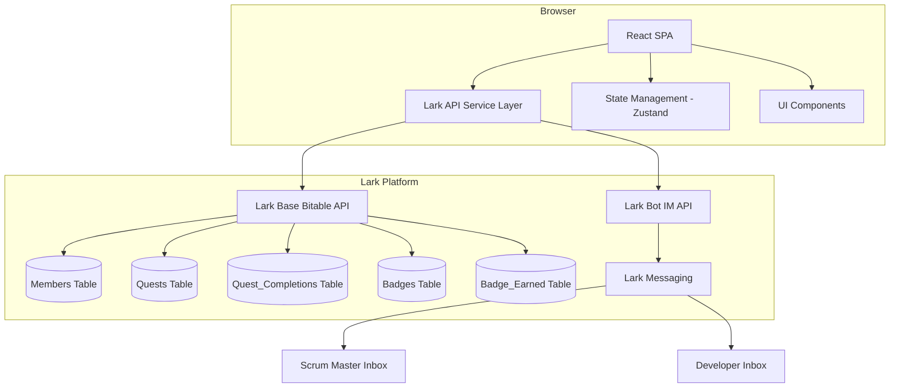

# Design Document: SP Madrid Gamified Tracker

## Overview

The SP Madrid Gamified Tracker is a frontend-only web application that gamifies onboarding and daily work at SP Madrid & Associates. It connects directly to Lark Base (Bitable) as the single source of truth for all data — no dedicated backend server is needed. The application uses the Lark Open Platform REST APIs for CRUD operations against five Bitable tables and leverages the Lark Bot messaging API for notifications.

**Key architectural decisions:**

- **Frontend-only MVP**: React SPA communicates directly with Lark Base API. Authentication and token management use the Lark Open Platform app credentials.
- **Lark Base as database**: Five tables (Members, Quests, Quest_Completions, Badges, Badge_Earned) store all state. The application never caches data beyond the browser session.
- **Lark Bot for notifications**: A registered Lark Bot sends messages to users via the IM API when task proposals are submitted and when approval/rejection decisions are made.
- **Badges over XP**: The sole progression mechanic is badge unlocks. No points or XP system. Leaderboards rank by badge count.
- **Approval gate for developers**: Developer tasks require Scrum Master approval before they can be completed or count toward badges/leaderboards.

**Tech stack:**

- React 18+ with TypeScript
- Vite for build tooling
- TailwindCSS for styling
- React Router for navigation
- Zustand for lightweight client state management
- Lark Base (Bitable) REST API via fetch/axios
- Lark Bot IM v1 API for messaging

## Architecture



**Request flow:**

1. User opens Tracker → React SPA initializes → fetches member profile from Members table → determines available roles → sets default role view
2. Quest board renders → fetches quests filtered by role → displays categorized quest cards
3. Quest completion → writes Quest_Completion record → evaluates badge conditions → writes Badge_Earned if conditions met → updates leaderboard
4. Task proposal (Developer) → writes quest with pending status → triggers bot notification to Scrum Master
5. Approval/Rejection (Scrum Master) → updates quest status → triggers bot notification to Developer

**Authentication approach:**

The Lark Open Platform app uses a tenant_access_token obtained via the app's credentials (app_id + app_secret). Since this is an internal company tool, the app runs as a self-built enterprise application within the SP Madrid Lark tenant. User identity is resolved by matching the logged-in Lark user's open_id against the Members table.

## Components and Interfaces

### Core Service Layer

```typescript
// lark-api.service.ts — Lark Base API wrapper
interface LarkApiService {
  // Generic CRUD operations against Bitable
  listRecords(tableId: string, filter?: LarkFilter, sort?: LarkSort[]): Promise<LarkRecord[]>;
  getRecord(tableId: string, recordId: string): Promise<LarkRecord>;
  createRecord(tableId: string, fields: Record<string, unknown>): Promise<LarkRecord>;
  updateRecord(tableId: string, recordId: string, fields: Record<string, unknown>): Promise<LarkRecord>;

  // Retry logic: up to 3 attempts, 10-second timeout per attempt
  // Returns last successful data on failure after retries
}

// lark-bot.service.ts — Lark Bot messaging wrapper
interface LarkBotService {
  sendMessage(recipientOpenId: string, message: LarkMessage): Promise<SendResult>;
  // Non-blocking: failure does not prevent triggering action from completing
}

// Types
interface LarkFilter {
  conjunction: 'and' | 'or';
  conditions: FilterCondition[];
}

interface FilterCondition {
  field_name: string;
  operator: 'is' | 'isNot' | 'contains' | 'isGreater' | 'isLess';
  value: string[];
}

interface LarkSort {
  field_name: string;
  order: 'asc' | 'desc';
}

interface LarkRecord {
  record_id: string;
  fields: Record<string, unknown>;
}

interface SendResult {
  success: boolean;
  messageId?: string;
  error?: string;
}
```

### Domain Services

```typescript
// quest.service.ts
interface QuestService {
  getQuestsForRole(role: 'agent' | 'developer', memberId: string): Promise<CategorizedQuests>;
  proposeTask(title: string, description: string, developerId: string): Promise<Quest>;
  approveTask(questId: string, scrumMasterId: string): Promise<Quest>;
  rejectTask(questId: string, scrumMasterId: string, reason: string): Promise<Quest>;
  completeQuest(questId: string, memberId: string): Promise<QuestCompletion>;
}

// badge.service.ts
interface BadgeService {
  evaluateBadgeUnlocks(memberId: string, role: 'agent' | 'developer'): Promise<Badge[]>;
  getBadgeCollection(memberId: string, role: 'agent' | 'developer'): Promise<BadgeCollectionView>;
}

// leaderboard.service.ts
interface LeaderboardService {
  getLeaderboard(role: 'agent' | 'developer'): Promise<LeaderboardEntry[]>;
}

// member.service.ts
interface MemberService {
  getCurrentMember(): Promise<Member>;
  getMemberById(memberId: string): Promise<Member>;
}

// notification.service.ts
interface NotificationService {
  notifyTaskProposal(quest: Quest, developer: Member, scrumMaster: Member): Promise<void>;
  notifyApproval(quest: Quest, scrumMaster: Member, developer: Member): Promise<void>;
  notifyRejection(quest: Quest, scrumMaster: Member, developer: Member, reason: string): Promise<void>;
}
```

### UI Components

```typescript
// Pages
QuestBoardPage        // Main quest board with role-filtered categories
LeaderboardPage       // Role-separated leaderboard rankings
BadgeCollectionPage   // User's earned/locked badge grid

// Layout
AppShell              // Top-level layout with nav and role switcher
RoleSwitcher          // Toggle between Agent/Developer views
NavigationBar         // Links to quest board, leaderboard, badges

// Quest Board Components
QuestCard             // Individual quest with completion checkbox
QuestCategory        // Category container (onboarding, daily, milestone, sprint, pending)
ProposeTaskForm       // Developer task proposal form
PendingTaskCard       // Task card with approve/reject buttons for Scrum Master
CompletionAnimation   // Visual feedback on quest completion

// Badge Components
BadgeGrid             // Grid layout of all role badges
BadgeCard             // Individual badge: earned (color) or locked (grayscale)
ProgressBar           // Fraction of badges earned

// Leaderboard Components
LeaderboardTable      // Ranked table of members
LeaderboardRow        // Single member row (highlighted if current user)

// Shared
LoadingIndicator      // Shown during API operations
ErrorBanner           // Shown on API failure after retries
ConfirmationToast     // Success messages for actions
ValidationError       // Form validation feedback
```

### State Management (Zustand)

```typescript
interface AppState {
  // Auth & User
  currentMember: Member | null;
  selectedRole: 'agent' | 'developer';

  // Quest Board
  quests: CategorizedQuests | null;
  questsLoading: boolean;

  // Leaderboard
  leaderboard: LeaderboardEntry[];
  leaderboardLoading: boolean;

  // Badges
  badgeCollection: BadgeCollectionView | null;
  badgesLoading: boolean;

  // Actions
  setRole(role: 'agent' | 'developer'): void;
  fetchQuests(): Promise<void>;
  completeQuest(questId: string): Promise<void>;
  proposeTask(title: string, description: string): Promise<void>;
  approveTask(questId: string): Promise<void>;
  rejectTask(questId: string, reason: string): Promise<void>;
  fetchLeaderboard(): Promise<void>;
  fetchBadgeCollection(): Promise<void>;
}
```

## Data Models

### Lark Base Tables

#### Members Table

| Field | Type | Description |
|-------|------|-------------|
| member_id | Text (Primary) | Unique member identifier |
| display_name | Text | Member's display name |
| open_id | Text | Lark Open Platform user ID for bot messaging |
| roles | Multi-select | Available roles: "agent", "developer" |
| primary_role | Single-select | Default role shown at session start |
| scrum_master_id | Text (Link) | The Scrum Master assigned to this Developer (null for Agents) |

#### Quests Table

| Field | Type | Description |
|-------|------|-------------|
| quest_id | Text (Primary) | Unique quest identifier |
| title | Text | Quest name (max 100 chars) |
| description | Text | Quest details (max 500 chars) |
| category | Single-select | "onboarding" / "daily" / "milestone" / "sprint" |
| target_role | Single-select | "agent" / "developer" |
| status | Single-select | "active" / "pending" / "rejected" |
| proposer_id | Text (Link) | Developer who proposed the task (sprint tasks only) |
| created_at | DateTime | Record creation timestamp |

#### Quest_Completions Table

| Field | Type | Description |
|-------|------|-------------|
| completion_id | Text (Primary) | Unique completion record identifier |
| member_id | Text (Link) | Completing member's ID |
| quest_id | Text (Link) | Completed quest's ID |
| completed_at | DateTime | Completion timestamp |

#### Badges Table

| Field | Type | Description |
|-------|------|-------------|
| badge_id | Text (Primary) | Unique badge identifier |
| name | Text | Badge display name |
| icon_url | URL | Badge icon image URL |
| target_role | Single-select | "agent" / "developer" |
| required_completions | Number | Quest completions needed to unlock |
| description | Text | Unlock condition description shown to users |

#### Badge_Earned Table

| Field | Type | Description |
|-------|------|-------------|
| earned_id | Text (Primary) | Unique earned record identifier |
| member_id | Text (Link) | Member who earned the badge |
| badge_id | Text (Link) | Badge that was earned |
| earned_at | DateTime | Timestamp when badge was awarded |

### Domain Types

```typescript
interface Member {
  memberId: string;
  displayName: string;
  openId: string;
  roles: ('agent' | 'developer')[];
  primaryRole: 'agent' | 'developer';
  scrumMasterId: string | null;
}

interface Quest {
  questId: string;
  title: string;
  description: string;
  category: 'onboarding' | 'daily' | 'milestone' | 'sprint';
  targetRole: 'agent' | 'developer';
  status: 'active' | 'pending' | 'rejected';
  proposerId: string | null;
  createdAt: Date;
}

interface QuestCompletion {
  completionId: string;
  memberId: string;
  questId: string;
  completedAt: Date;
}

interface Badge {
  badgeId: string;
  name: string;
  iconUrl: string;
  targetRole: 'agent' | 'developer';
  requiredCompletions: number;
  description: string;
}

interface BadgeEarned {
  earnedId: string;
  memberId: string;
  badgeId: string;
  earnedAt: Date;
}

interface CategorizedQuests {
  onboarding?: Quest[];
  daily?: Quest[];
  milestones?: Quest[];
  sprint?: Quest[];
  pending?: Quest[];
}

interface BadgeCollectionView {
  badges: Array<{
    badge: Badge;
    earned: boolean;
    earnedAt?: Date;
  }>;
  earnedCount: number;
  totalCount: number;
}

interface LeaderboardEntry {
  member: Member;
  badgeCount: number;
  rank: number;
}
```

## Correctness Properties

*A property is a characteristic or behavior that should hold true across all valid executions of a system — essentially, a formal statement about what the system should do. Properties serve as the bridge between human-readable specifications and machine-verifiable correctness guarantees.*

### Property 1: Role-based quest filtering

*For any* set of quests in the database and any member with a given role, the quest filter function shall return only quests whose `target_role` matches the requested role — no quests for other roles shall appear in the result.

**Validates: Requirements 1.1**

### Property 2: Task proposal title validation

*For any* string that is empty, consists only of whitespace, or exceeds 100 characters, the task proposal validation function shall reject it. *For any* non-empty string of 1–100 non-whitespace-only characters, validation shall accept it.

**Validates: Requirements 2.2**

### Property 3: Task proposal record integrity

*For any* valid task proposal submission by a developer, the resulting quest record shall always have `status` equal to "pending" and `proposer_id` equal to the submitting developer's member_id.

**Validates: Requirements 2.1**

### Property 4: Pending/rejected quest completion prevention

*For any* quest with a status of "pending" or "rejected" and any member, the completion function shall reject the completion attempt and no Quest_Completion record shall be created.

**Validates: Requirements 4.3, 11.3**

### Property 5: Pending task modification lockdown

*For any* quest with "pending" status and any developer (including the proposer), the permission check function shall return false for edit, delete, and complete operations.

**Validates: Requirements 2.4**

### Property 6: Scrum Master assignment resolution

*For any* developer member with a `scrum_master_id` field, the notification target resolution function shall always return the member_id matching that `scrum_master_id` value.

**Validates: Requirements 2.6**

### Property 7: Approval/rejection button visibility

*For any* pending task and any viewer, the approve/reject buttons shall be visible if and only if the viewer is the assigned Scrum Master for the task's proposer AND the viewer's member_id does not match the task's `proposer_id`.

**Validates: Requirements 3.1, 3.5**

### Property 8: Approve state transition

*For any* quest with "pending" status, when the assigned Scrum Master approves it, the resulting quest status shall always be "active".

**Validates: Requirements 3.2**

### Property 9: Reject state transition

*For any* quest with "pending" status and any non-empty rejection reason of 1–250 characters, when the assigned Scrum Master rejects it, the resulting quest status shall always be "rejected".

**Validates: Requirements 3.3**

### Property 10: Duplicate completion prevention

*For any* member and quest combination where a Quest_Completion record already exists, a subsequent completion attempt shall always be rejected without creating a new record.

**Validates: Requirements 4.5**

### Property 11: Badge threshold evaluation

*For any* member whose total qualifying Quest_Completions count is greater than or equal to a badge's `required_completions` threshold, the badge evaluation function shall include that badge in the list of badges to award. *For any* count below the threshold, the badge shall not be included.

**Validates: Requirements 5.1**

### Property 12: Active-only completions for developer calculations

*For any* developer member's set of Quest_Completions, the badge progress calculation and leaderboard ranking calculation shall count only those completions linked to quests with "active" status — completions for "pending" or "rejected" quests shall be excluded.

**Validates: Requirements 5.4, 11.1, 11.2**

### Property 13: Duplicate badge prevention

*For any* member and badge combination where a Badge_Earned record already exists, the badge evaluation function shall not produce a duplicate Badge_Earned record.

**Validates: Requirements 5.5**

### Property 14: Multi-badge simultaneous unlock

*For any* Quest_Completion that causes the member's qualifying completion count to meet or exceed the thresholds of multiple badges simultaneously, all qualifying badges shall be awarded in the same evaluation pass.

**Validates: Requirements 5.6**

### Property 15: Leaderboard ranking order

*For any* set of members on a leaderboard, the ranking shall be sorted by total badge count in descending order. *For any* two members with equal badge counts, the member whose display_name comes first alphabetically shall have the higher rank (lower rank number).

**Validates: Requirements 6.2**

### Property 16: Leaderboard role separation

*For any* leaderboard view, every entry in the Agent leaderboard shall have role "agent", and every entry in the Developer leaderboard shall have role "developer" — no entry shall appear on a leaderboard for a role it does not belong to.

**Validates: Requirements 6.3**

### Property 17: Leaderboard completeness

*For any* role's leaderboard, every member in the Members table with that role shall appear in the leaderboard results, including members with zero earned badges.

**Validates: Requirements 6.5**

### Property 18: Badge collection correctness

*For any* member viewing their badge collection for a given role: (a) all badges defined for that role shall be present in the collection view, (b) each badge's earned/locked state shall match whether a Badge_Earned record exists for that member+badge, and (c) the progress fraction shall equal the count of earned badges divided by the total badge count for that role.

**Validates: Requirements 7.1, 7.2, 7.3**

### Property 19: Role switcher visibility

*For any* member, the role switcher control shall be visible if and only if the member's `roles` array contains more than one role.

**Validates: Requirements 10.1, 10.2**

### Property 20: Retroactive status change exclusion

*For any* Quest_Completion record linked to a quest whose status has changed from "active" to "rejected", that completion shall be excluded from both badge progress and leaderboard calculations on the next recalculation.

**Validates: Requirements 11.6**

## Error Handling

### API Failure Strategy

| Scenario | Behavior |
|----------|----------|
| Lark Base API read fails (after 3 retries) | Display error banner, retain last successful data, disable refresh-dependent actions |
| Lark Base API write fails (after 3 retries) | Display error message identifying the failed operation, do not discard user input |
| Lark Bot notification fails | Display non-blocking warning toast, allow triggering action to complete, log failure details |
| Badge_Earned write fails | Retain Quest_Completion as valid, show badge-award warning, re-evaluate on next completion event |
| Recipient resolution fails | Treat as notification delivery failure, apply same handling as bot failure |

### Retry Configuration

- **Max retries**: 3 attempts per API call
- **Timeout**: 10 seconds per attempt
- **Strategy**: Linear retry (immediate retry on failure, no exponential backoff for MVP)
- **Scope**: Retries apply to individual Lark Base API calls, not composite operations

### Validation Errors

| Field | Rule | Error Message |
|-------|------|---------------|
| Task title | Required, 1–100 chars, not whitespace-only | "Title is required and must be 1–100 characters" |
| Task description | Optional, max 500 chars | "Description must be 500 characters or fewer" |
| Rejection reason | Required when rejecting, 1–250 chars | "Rejection reason is required (max 250 characters)" |

### Loading States

- All API-dependent views show a loading indicator during requests
- User actions that depend on pending operations are disabled (buttons grayed, checkboxes non-interactive)
- Loading state is per-section (quest board, leaderboard, badge collection can load independently)

## Testing Strategy

### Unit Tests

Unit tests cover specific examples, edge cases, and component integration:

- **Quest filtering**: Agent role returns onboarding/daily/milestone categories; Developer role returns sprint/pending sections
- **Empty states**: Zero quests, zero badges, new user with no completions
- **Validation edge cases**: Title at exactly 100 chars (valid), 101 chars (invalid), whitespace variations
- **Permission checks**: Self-approval prevention, pending task lockdown
- **Error message content**: Correct messages for pending/rejected completion attempts
- **UI component rendering**: Correct visual states for earned/locked badges, highlighted leaderboard row

### Property-Based Tests

Property-based tests verify the 20 correctness properties using [fast-check](https://github.com/dubzzz/fast-check) (JavaScript/TypeScript PBT library).

**Configuration:**
- Minimum 100 iterations per property test
- Each test tagged with: **Feature: sp-madrid-gamified-tracker, Property {N}: {property_text}**

**Property test coverage:**
- Quest role filtering (Property 1)
- Title validation accept/reject (Property 2)
- Task proposal record fields (Property 3)
- Completion prevention for non-active quests (Property 4)
- Pending task lockdown (Property 5)
- Scrum Master resolution (Property 6)
- Button visibility permission logic (Property 7)
- State transitions: approve → active, reject → rejected (Properties 8, 9)
- Duplicate completion prevention (Property 10)
- Badge threshold evaluation (Property 11)
- Active-only filtering for developer calculations (Property 12)
- Duplicate badge prevention (Property 13)
- Multi-badge unlock (Property 14)
- Leaderboard sort order with tie-breaking (Property 15)
- Leaderboard role separation (Property 16)
- Leaderboard completeness (Property 17)
- Badge collection correctness (Property 18)
- Role switcher visibility logic (Property 19)
- Retroactive exclusion on status change (Property 20)

### Integration Tests

Integration tests verify Lark Base API and bot connectivity with mocked services:

- API call construction (correct endpoints, headers, payloads)
- Retry behavior (3 retries, 10-second timeout)
- Bot notification delivery (correct recipient, message content)
- Error recovery (graceful degradation on API failures)
- Session behavior (no data persisted beyond session)

### Test Organization

```
src/
  services/
    __tests__/
      quest.service.test.ts          # Unit + property tests for quest logic
      badge.service.test.ts          # Unit + property tests for badge evaluation
      leaderboard.service.test.ts    # Unit + property tests for ranking
      member.service.test.ts         # Unit tests for member resolution
      notification.service.test.ts   # Integration tests with mocked bot
      lark-api.service.test.ts       # Integration tests for API layer
  utils/
    __tests__/
      validation.test.ts             # Property tests for input validation
      permissions.test.ts            # Property tests for permission checks
```

